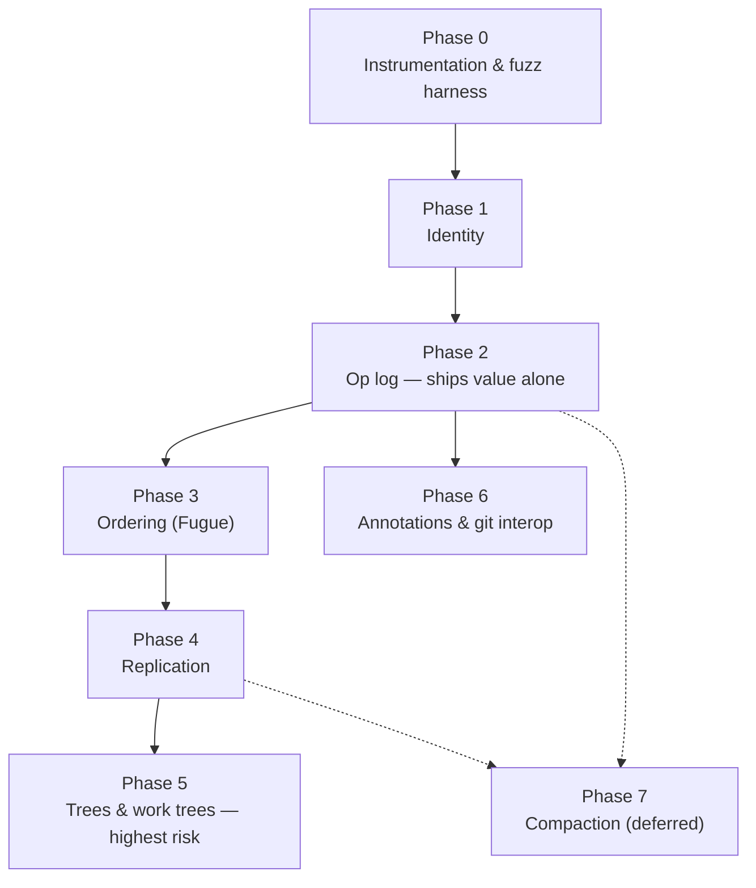

# Delta DB — Implementation Plan

Sub-commit, conflict-free, provenance-carrying version control for the platform.

The goal: every version of the code has an address, every change knows what caused
it, annotations survive edits and rebases, and two writers (human or agent) can work
the same file without a coordinator.

---

## 1. Ground truth — what already exists

This is not a greenfield build. Four of the load-bearing pieces are already in the
repo, and they are the ones that are painful to retrofit.

### The editor is already CRDT-shaped

`packages/editor-core/src/pieceTable/` has the structural preconditions:

| Property              | Where                                                                    | Why it matters                                                                      |
| --------------------- | ------------------------------------------------------------------------ | ----------------------------------------------------------------------------------- |
| Tombstones            | `edits.ts` — `markTreeInvisible` flips `visible: false`, never removes   | Hardest precondition to retrofit. Present.                                          |
| Append-only buffers   | `buffers.ts` — content is never mutated                                  | Character identity is stable for the document's life. This _is_ the CRDT substrate. |
| Persistent snapshots  | `tree.ts` — treap `split`/`merge`, structural sharing                    | Local time-travel already works.                                                    |
| Anchors with liveness | `anchors.ts` — `RealAnchor{buffer, offset, bias}` → `{offset, liveness}` | A Yjs `RelativePosition` in all but name. Survives deletion and reports it.         |

### The server is already event-sourced

`apps/server/src/orchestration/` + `apps/server/src/db/schema.ts`:

- `orchestration_events` carries `eventId`, `aggregateKind`, `aggregateId`,
  `streamVersion`, `causationEventId`, `correlationId`, `commandId`, `actorKind`.
  That is a textbook event store with causation tracking already wired.
- `OrchestrationEventStore.append` computes `streamVersion` inside the INSERT under
  the write lock — safe concurrent appends.
- `projection-pipeline.ts` / `projector.ts` — an established read-model pattern.
- `ws-rpc.ts` + `streams.ts` — live subscription transport.

**We do not need to build an op log. We need a new aggregate kind on the one that
exists.**

### Git checkpointing per turn already exists

`checkpoint-reactor.ts`, `git/checkpoint-store.ts`, `checkpoint-refs.ts` capture the
worktree to hidden refs (`refs/t3/checkpoints/<thread>/turn/N`) at turn boundaries,
with a baseline capture before the agent's first edit. Turn-granularity version
control is done. Delta DB is the same idea pushed below the turn.

### Worktrees exist

`git/worktrees.ts` (388 lines) — real git worktrees per thread. Phase 5 gets to ask
whether virtualization beats this, rather than starting from nothing.

---

## 2. The three real gaps

**G1 — `PieceBufferId` is locally scoped.** Minted from `nextBufferSequence`, a
per-document counter. Two replicas both mint buffer #7, so `{buffer: 'b7', offset: 3}`
denotes different characters on different machines. Make it `(replicaId, sequence)`
and every existing anchor becomes a globally-unique character ID.

**G2 — `order` is a fractional index.** `orders.ts` allocates midpoints and, when the
gap collapses below `PIECE_ORDER_MIN_GAP`, sets `normalizeOrders: true` → global
renumber. Two failures, one fatal:

- Concurrent inserts into the same gap allocate overlapping values, so two replicas
  holding the _identical op set_ can derive _different sequences_. That is divergence,
  not merely bad interleaving.
- A global renumber is non-commutative and non-idempotent. It invalidates order
  comparisons against any concurrent remote op.

Ordering must become a deterministic function of op identity and origin neighbours.

**G3 — Edits are expressed in document offsets.** `applyBatchToPieceTable` takes
`{from, to, text}`, meaningful only against one snapshot. Remote ops need ID space
(`insert after character X`, `delete span Y`) plus causal metadata.

---

## 3. The architectural spine

> **The op log is the source of truth. The live document stays a plain piece table.
> CRDT machinery is materialized transiently at merge time, then discarded.**

This is the eg-walker / diamond-types design, and it is the opposite of "make the
piece table a CRDT". Rationale:

- **The typing hot path stays untouched.** No per-character IDs, no origin pointers,
  no widened `Piece`. The 90ms → 5.8ms typing work is not put at risk to serve a case
  that is rare.
- **Merge cost is proportional to divergence,** not to document size.
- **The op log _is_ the product.** Model blame, every-version-has-an-address,
  sub-commit comments, "why does this line exist" — all fall out of the log. The CRDT
  is only what makes concurrent branches merge without a coordinator.

Character ID = `(replicaId, bufferSeq, offset)` — which is exactly today's `RealAnchor`
once G1 is fixed. The existing anchor type becomes the CRDT position type with a
one-field change.

---

## 4. Phases

### Phase 0 — Instrumentation and ground truth

Prerequisite for evaluating everything after it.

- Wide evlog events on edit application: `editor.edit.applied` carrying `pieceCount`,
  `tombstoneRatio`, `coalesced`, `cause`, `durationMs`. Enrich the existing event
  rather than adding narrow lines.
- Benchmark baseline: typing latency p50/p99, snapshot memory, anchor resolution p99,
  piece count growth over a long session. **No phase 3–5 change is acceptable without
  a before/after against this.**
- Property/fuzz harness for the piece table: random edit sequences asserted against a
  naive string model; anchors asserted to resolve monotonically and never cross. This
  is the safety net for every phase after, and it pays for itself immediately.

**Exit:** a committed benchmark run and a fuzz suite that fails loudly on divergence.

### Phase 1 — Identity

Small, strictly additive, unblocks everything.

- `PieceBufferId` → `${replicaId}:${seq}`. `replicaId` minted per device+document
  session and persisted.
- Anchor wire format + valibot schema in `packages/contracts`.
- **Gate `tryCoalesceInsert` on cause identity.** Today it extends the tail chunk and
  grows a piece in place, welding two causally distinct inserts into one attributable
  span — which silently destroys per-turn provenance. Refuse to coalesce across a
  cause boundary.
- **Preserve replace-intent** in `applyBatchToPieceTable`. It currently decomposes each
  edit into delete-then-insert; a remote replica would see two independent ops and
  could legally insert into the middle of what was meant as one atomic replacement.

**Exit:** an anchor serialized in one process resolves correctly in another against the
same document. No CRDT yet.

### Phase 2 — Op log

The phase that ships user-visible value on its own. If everything after is cancelled,
this was still worth building.

- New aggregate kind `document` on `orchestration_events` (schema change: widen the
  `aggregateKind` enum). Op events ride the existing store, replay, projection
  pipeline and WS transport unchanged.
- `DocumentOp` union in contracts: `insert{afterId, text}`, `delete{spans}`,
  `replace{spans, text}` as an atomic unit.
- Transform layer at the `documentSession` boundary: `PieceTableEdit[]` (offsets) →
  `DocumentOp[]` (IDs).
- Rehydration: replay ops → piece table snapshot, property-tested for equality with
  the live snapshot.
- **Wire causation.** An edit op caused by a provider tool call carries that event's
  `causationEventId`; `correlationId` carries the turn. The plumbing already exists.
- Projection `projection_document_blame`: span → (turnId, actorKind, model, prompt).

**Exit:** model blame per span. "Why is this line here" jumps to the turn that wrote
it. Time travel to any op, not just any commit.

### Phase 3 — Ordering

The actual CRDT. New package `packages/crdt`, runtime-neutral, plain vitest.

- Implement **Fugue** (Weidner), not RGA. Same difficulty, and it fixes the
  interleaving pathology. That pathology is not academic here: two agents editing the
  same function concurrently is the core use case, and RGA will shuffle their lines
  into garbage.
- Fractional `order` demoted to a local materialization cache for the treap index.
  It is never the cross-replica ordering authority, and `normalizeOrders` must not
  appear on any path that crosses a replica.
- Merge = find the LCA in version-vector space, replay the diverged suffix on both
  sides.
- Property tests: N replicas × random concurrent op sets → convergence; plus explicit
  non-interleaving assertions for the two-agents-one-function case.

**Exit:** convergence fuzz green at N=5 replicas; typing benchmark unregressed vs
phase 0.

### Phase 4 — Replication

- Op sync over the existing WS RPC. Version vectors; delta sync sends only ops after
  the peer's VV.
- Server is the hub. No P2P — it buys nothing here and doubles the work.
- Presence and remote cursors ride the same anchors.
- Awareness UX: there is nothing to resolve, but _whose ops_ must be visible.

**Exit:** two clients edit one file concurrently, converge, and both see attribution.

### Phase 5 — Trees and work trees

Highest risk in the project. Budget accordingly and do not start it early.

- Tree CRDT for create/rename/delete/move — Kleppmann's highly-available move
  operation for replicated trees. Do not re-derive it.
- **Materialization and reconciliation with the real filesystem.** Agents, formatters,
  compilers and `bun install` write behind the model. This collides directly with
  `fs/watch.ts` and `fs/workspace-index.ts`. Atomic-rename saves, gitignore,
  `node_modules`, large binaries. This is where projects of this shape die.
- Virtualized work trees (O(1) clone) — **only if measured against the existing
  `git/worktrees.ts`.** Decision point D2 below.

**Exit:** an agent branch clones, diverges, and merges without touching the user's
working tree unexpectedly.

### Phase 6 — Annotations and git interop

Can run in parallel with 3–4; depends only on phase 2.

- Comments/annotations anchored to spans, resolvable in any version where the span
  survives. The anchor machinery already handles the hard half.
- Map document versions ↔ git commits; extend the existing checkpoint refs from
  per-turn to per-op addressing.
- **Rewrite policy.** Rebase, amend, force-push destroy the characters anchors point
  at. Policy: degrade to `liveness: 'deleted'` plus a best-effort content-match
  re-anchor, surfaced honestly in the UI rather than silently relocated.

### Phase 7 — Compaction

Deliberately deferred. It is a scaling problem, not a correctness one, and premature
compaction destroys the provenance that is the entire point.

- Op log growth: keystroke granularity × agents rewriting whole files dwarfs the
  content.
- Snapshotting + shallow history + causal-stability-based tombstone GC. A tombstone
  cannot be dropped until every replica has seen the delete.

---

## 5. Risk register

| #   | Risk                                                    | Phase | Mitigation                                                                                                        |
| --- | ------------------------------------------------------- | ----- | ----------------------------------------------------------------------------------------------------------------- |
| R1  | FS reconciliation swamp — external writers vs the model | 5     | Sequenced last; existing `fs/watch.ts` reused rather than replaced; fall back to real git worktrees if D2 says so |
| R2  | Op log / tombstone growth                               | 7     | Deferred by design; phase 0 instrumentation makes the growth curve visible early                                  |
| R3  | Typing hot-path regression                              | 3     | Architectural: CRDT stays out of the live structure. Verified against phase 0 benchmarks                          |
| R4  | Coalescing destroys provenance                          | 1     | Fixed in phase 1 (cause-gated coalescing)                                                                         |
| R5  | Binary files have no CRDT                               | 5     | Content-address + last-writer-wins on a separate path                                                             |
| R6  | Divergence bugs found late                              | 0     | Fuzz harness before any semantic change                                                                           |

---

## 6. Explicit non-goals

- No P2P / coordinator-free topology. The server is the hub.
- No custom B-tree or KV store. SQLite + drizzle already carries this.
- No WASM/web client.
- No custom text CRDT **if** D1 shows an existing library fits.

---

## 7. Decision points

**D1 — own Fugue implementation vs. an existing library (Loro).** Before phase 3.
Criterion: can Loro accept our existing anchors and piece table, or does it insist on
owning the buffer? If it demands ownership, the integration cost exceeds the
implementation cost, because our anchor layer is already built. Timebox: 2-day spike.

**D2 — virtualized work trees vs. plain git worktrees.** Before phase 5. Criterion:
measured clone cost and agent-branch spawn latency against `git/worktrees.ts` under a
realistic repo. Only go virtual if the measurement demands it.

---

## 8. Sequencing rationale

Value ships at **phase 2**, before any CRDT exists. Risk concentrates at **phase 5**,
last. Phases 0–2 are strictly additive and reversible; nothing before phase 3 changes
existing edit semantics.

The tempting order — build the DB first, then the features — inverts both the risk and
the value curves.
