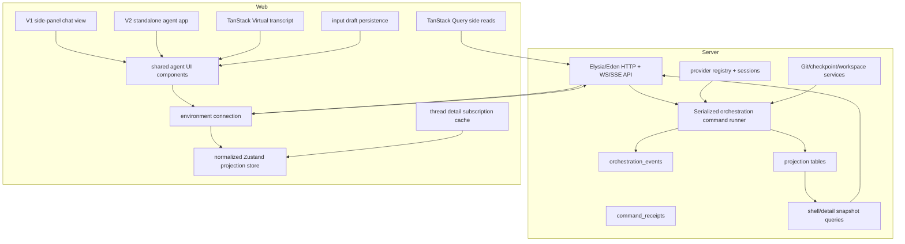

# Platform Agent Architecture Plan

This plan turns the T3Code reference into implementation phases for Platform.
The goal is not full T3Code parity. The goal is a Platform-native agent/chat
system that borrows T3Code's proven event/projection/runtime model where it
solves real Platform problems, while keeping Platform's stack:

- Bun
- Elysia/Eden
- Drizzle
- Valibot
- React
- Zustand
- TanStack Query
- existing `@workspace/ui` shadcn/Base UI components

We are not copying Effect as a backend requirement, and we are not treating
T3Code feature parity as the product target. We are copying the architecture
spine that makes T3Code fast and recoverable:

- append-only event log as durable truth
- command receipts/idempotency
- projection tables as the server read model
- projector progress through `projection_state`
- shell/detail snapshots and streams
- sequence-based client recovery
- provider sessions/runtime separation
- normalized bounded client projection cache

Product shape:

- V1 is a side-panel chat inside the existing Platform workspace.
- V1 still uses the real agent/chat core. The side panel must not own chat
  concepts or create throwaway components.
- V2 is a standalone agent app/workbench view, similar in spirit to T3Code,
  Codex, or Claude Code.
- V1 and V2 share contracts, transport, projection cache, runtime/session model,
  and reusable chat UI components.

Reference doc:

- `docs/t3code-reference.md`

Current Platform anchors:

- `apps/server/src/app.ts`
- `apps/server/src/db/schema.ts`
- `apps/server/src/git/*`
- `apps/server/src/fs/*`
- `apps/server/src/terminal/*`
- `packages/contracts/src/*`
- `apps/web/src/App.tsx`
- `apps/web/src/lib/query-client.ts`
- `packages/ui/src/components/*`

External UI references:

- `https://tanstack.com/virtual/latest/docs/chat`

Chat UI strategy:

- Do not use external chat UI registries in Platform chat. The previous local
  registry was removed and product chat surfaces must be Platform-owned
  components.
- Use T3Code for architecture, runtime semantics, projection-driven state,
  shell/detail subscriptions, recovery, and rich input behavior.
- Use TanStack Virtual for the transcript. The chat timeline keeps normal item
  order, stable item keys, dynamic row measurement, pinned-to-end behavior, and
  an explicit scroll-to-latest affordance.
- Use Lexical for chat input. The input must not be controlled by React state
  while the user types; React state is allowed only for coarse UI state such as
  submitting/disabled/busy.
- Keep workspace-specific shell components thin. Shared chat components live
  under `apps/web/src/features/chat/components/*` and stay reusable for a later
  standalone agent app.

## Target Shape

## Phase 0: Scope Lock And Source Map

Purpose:

- Freeze the first Platform agent target so we do not implement T3Code all at
  once.
- Decide the first provider/runtime target.
- Decide transport details.
- Decide which T3Code architecture pieces are copied and which product features
  are deferred.
- Decide which Platform-owned chat UI primitives are needed for V1.

Locked decisions:

- T3Code parity is not the goal. Platform owns the product shape.
- Phase 0 is documentation/spec work only. Do not add runtime code, migrations,
  schemas, routes, or UI implementation in this phase.
- V1 is local-only chat in the existing workspace. The first product surface is
  a chat tab in the left workspace sidebar, not a standalone app and not a
  remote environment.
- Backend truth: the append-only event log is durable truth. Projection tables
  are the server read model. The UI never owns durable transcript state.
- Frontend component sourcing: Platform-owned components only. Do not use
  external chat UI registries in V1 chat.
- Event store: required in V1.
- Server projections: required in V1. They are the fast read model over the
  append-only log, not optional polish.
- Client projection cache: Zustand in V1. TanStack DB is a later evaluation
  after the T3-style store is proven in Platform.
- TanStack Query: command request lifecycle and side reads only, not the durable
  chat transcript owner.
- Recovery: design snapshots/events with sequence guards from the start.
  Replay can be simplified in the first slice, but the contracts must not block
  replay recovery later.
- Transport: all-in on Eden/Elysia. Use Eden HTTP for command dispatch,
  snapshots, and replay. Use Elysia/Eden WebSockets for shell/detail
  subscriptions. Each stream sends one initial snapshot followed by
  sequence-tagged updates.
- First provider adapter: Codex first. Mocks are allowed for automated tests, but
  the product path starts with Codex. The default driver kind is `codex`, and
  the default provider instance ID is `codex`.
- First runtime mode: `full-access`. Keep `approval-required` and
  `auto-accept-edits` in contracts/data as supervised-mode placeholders, but do
  not build supervised UI or enforcement in V1.
- First UI shape: extend the existing workspace left rail with a chat symbol and
  render chat as a left-sidebar tab. This side panel is a view over shared agent
  core/components.
- Second UI shape: standalone agent app/workbench view using the same
  contracts, projection cache, runtime, and UI primitives.
- First persistence scope: one local backend environment. Remote environments
  come later.
- V1 transcript implementation: TanStack Virtual, not Legend List and not
  `use-stick-to-bottom`.
- V1 input implementation: Lexical, named `ChatInput`, with uncontrolled text
  editing and draft persistence outside React keystroke state.

Deliverables:

- Finalized command/event/schema list for phase 1.
- Codex-first provider/runtime assumptions for phase 7.
- Full-access-first runtime mode contract with supervised placeholders.
- Left-sidebar chat entry/panel UI target.
- Standalone app reuse constraints for shared chat components.
- Platform-owned chat UI map for transcript, messages, header/history, and
  input.
- A short "not in v1" list.

Phase 1 locked contract names:

- Contract modules are Platform-owned Valibot/TypeScript modules under
  `packages/contracts/src`: `chat-ids.ts`, `chat-model.ts`,
  `orchestration-commands.ts`, `orchestration-events.ts`,
  `orchestration-snapshots.ts`, and `orchestration-runtime.ts`.
- Opaque ID schemas/types: `ProjectId`, `ThreadId`, `MessageId`, `TurnId`,
  `CommandId`, `EventId`, `ProviderInstanceId`, `ApprovalRequestId`, and
  `ProposedPlanId`.
- Runtime/provider schemas:
  - `RuntimeMode`: `full-access`, `approval-required`, `auto-accept-edits`.
  - `InteractionMode`: `default`, `plan`.
  - `ProviderDriverKind`: open slug; first built-in/default value is `codex`.
  - `ProviderInstanceId`: open slug; first/default value is `codex`.
  - `ModelSelection`: `{ providerInstanceId, model, options? }`.
- Client-dispatchable commands for Phase 1 schemas:
  - `project.create`
  - `project.meta.update`
  - `project.delete`
  - `thread.create`
  - `thread.meta.update`
  - `thread.delete`
  - `thread.archive`
  - `thread.unarchive`
  - `thread.runtime-mode.set`
  - `thread.interaction-mode.set`
  - `thread.turn.start`
  - `thread.turn.interrupt`
  - `thread.session.stop`
  - `thread.approval.respond`
  - `thread.user-input.respond`
- Internal/runtime commands for Phase 1 schemas:
  - `thread.session.set`
  - `thread.message.assistant.delta`
  - `thread.message.assistant.complete`
  - `thread.activity.append`
  - `thread.proposed-plan.upsert`
  - `thread.turn.diff.complete`
  - `thread.revert.complete`
- Do not add separate client commands for proposed-plan accept/follow-up in
  Phase 1. Later plan follow-up or implementation turns use
  `thread.turn.start.sourceProposedPlan`; runtime plan materialization uses the
  internal `thread.proposed-plan.upsert` command.
- Domain events for Phase 1 schemas:
  - `project.created`
  - `project.meta-updated`
  - `project.deleted`
  - `thread.created`
  - `thread.meta-updated`
  - `thread.deleted`
  - `thread.archived`
  - `thread.unarchived`
  - `thread.runtime-mode-set`
  - `thread.interaction-mode-set`
  - `thread.message-sent`
  - `thread.turn-start-requested`
  - `thread.turn-interrupt-requested`
  - `thread.session-stop-requested`
  - `thread.session-set`
  - `thread.activity-appended`
  - `thread.proposed-plan-upserted`
  - `thread.turn-diff-completed`
  - `thread.reverted`
  - `thread.approval-response-requested`
  - `thread.user-input-response-requested`
- Turn status is projected from `thread.turn-start-requested`,
  `thread.session-set`, runtime ingestion, and `projection_turns.state`. Do not
  introduce separate `thread.turn-started`, `thread.turn-completed`, or
  `thread.turn-failed` events in Phase 1.
- Snapshot/stream/replay contract types:
  - `OrchestrationShellSnapshot`
  - `OrchestrationThreadDetailSnapshot`
  - `OrchestrationShellStreamItem`
  - `OrchestrationThreadStreamItem`
  - `OrchestrationReplayEventsInput`
  - `OrchestrationReplayEventsResult`
  - `OrchestrationCommandReceipt`

Phase 1 locked persistence scope:

- Implement these tables first:
  - `orchestration_events`
  - `orchestration_command_receipts`
  - `projection_state`
  - `projection_projects`
  - `projection_threads`
  - `projection_thread_messages`
  - `projection_thread_activities`
  - `projection_thread_sessions`
  - `projection_turns`
  - `provider_session_runtime`
- Include shell-summary columns on `projection_threads` from the first
  migration: `latest_user_message_at`, `pending_approval_count`,
  `pending_user_input_count`, and `has_actionable_proposed_plan`.
- Include `runtime_mode`, `interaction_mode`, `model_selection_json`,
  `archived_at`, and `deleted_at` on `projection_threads` from the first
  migration.
- Include `provider_instance_id` on `projection_thread_sessions` and
  `provider_session_runtime` from the first migration.
- Store command/event/snapshot payloads as canonical JSON matching the
  contracts; do not parse command/event payloads with ad hoc string logic.
- Defer these tables until their product surfaces exist:
  - `projection_pending_approvals`
  - `projection_thread_proposed_plans`
  - checkpoint/diff projection tables

Transport source map:

- Add an Elysia group at `/orchestration`, mounted from `apps/server/src/app.ts`
  through an orchestration routes module.
- HTTP endpoints:
  - `POST /orchestration/commands` dispatches one client command and returns
    `{ sequence }`.
  - `GET /orchestration/shell-snapshot` returns the shell snapshot.
  - `GET /orchestration/thread-detail?threadId=...` returns one thread detail
    snapshot.
  - `POST /orchestration/replay` returns events after `afterSequence`, scoped by
    optional aggregate/thread filters when provided.
- WebSocket endpoints:
  - `WS /orchestration/shell` sends `OrchestrationShellStreamItem`.
  - `WS /orchestration/thread?threadId=...` sends
    `OrchestrationThreadStreamItem`.
- Streams must reject stale client state by sequence: clients ignore snapshots
  or events older than the current scoped sequence.

Left-sidebar UI source map:

- Extend `WorkspacePanelTab` in `apps/web/src/lib/workspace-cache.ts` with
  `chat`, and include it in the persisted tab schema.
- Extend `isWorkspacePanelTab()` and `workspacePanelTabTitle()` in
  `apps/web/src/components/workspace/workspace-view-utils.ts`.
- Add a Phosphor `ChatCircleIcon` activity tab in
  `apps/web/src/components/workspace/workspace-activity-bar.tsx`.
- Add a `TabsContent` for `chat` in
  `apps/web/src/components/workspace/workspace-sidebar.tsx`.
- Keep workspace-specific shell components thin. Shared chat components must
  live under `apps/web/src/features/chat/components/*` and must not import
  workspace-only state except through the side-panel wrapper.

V1 chat UI implementation map:

- `apps/web/src/features/chat/components/messages-timeline.tsx`: TanStack
  Virtual transcript with stable row identity, measured dynamic heights,
  pinned-to-end behavior, and explicit scroll-to-latest.
- `apps/web/src/features/chat/components/message-bubble.tsx`: Platform-owned
  message rendering backed by projection message types and Streamdown markdown
  for assistant text.
- `apps/web/src/features/chat/components/chat-input*.tsx`: Lexical input with
  submit, disabled, stop, draft, and optimistic-send behavior routed through
  Platform chat state and orchestration commands.
- `apps/web/src/features/chat/components/chat-panel-header.tsx`: top-bar New
  Chat and History controls. Do not reintroduce the old in-canvas past
  conversation list.
- Future plan/tool/approval UI must be Platform-owned and projection-backed.
  Add it only when the matching backend projections exist.

Not in V1:

- remote environments
- standalone agent workbench routing
- supervised approvals UI/enforcement
- file mentions
- slash commands
- drag/drop or image attachments
- full model picker in the input
- proposed-plan implementation flow
- checkpoints/diffs/revert
- terminal context insertion
- TanStack DB
- locally persisted transcript data

Source paths and external refs:

- `docs/t3code-reference.md`
- `references/t3code/packages/contracts/src/orchestration.ts`
- `references/t3code/packages/contracts/src/providerInstance.ts`
- `references/t3code/packages/contracts/src/providerRuntime.ts`
- `references/t3code/apps/server/src/orchestration/Schemas.ts`
- `references/t3code/apps/server/src/orchestration/decider.ts`
- `references/t3code/apps/server/src/orchestration/Layers/ProviderRuntimeIngestion.ts`
- `references/t3code/apps/web/src/components/ChatView.tsx`
- `references/t3code/apps/web/src/components/chat/ChatComposer.tsx`
- `https://tanstack.com/virtual/latest/docs/chat`

## Phase 1: Contracts And Persistence Foundation

Purpose:

- Add the durable backend data model that every later phase depends on.
- Keep contracts in `packages/contracts` so web/server stay in sync.
- Keep V1 narrow: define the full direction, but only implement the tables and
  events needed for the first local Codex chat slice.

Platform target paths:

- `packages/contracts/src/chat-*`
- `packages/contracts/src/orchestration-*`
- `apps/server/src/db/schema.ts`
- `apps/server/src/db/migrations.ts`
- `apps/server/src/orchestration/*`
- `apps/server/src/persistence/*`

Backend work:

- Add branded IDs or opaque string types:
  - `ProjectId`
  - `ThreadId`
  - `MessageId`
  - `TurnId`
  - `CommandId`
  - `EventId`
  - `ProviderInstanceId`
  - `ApprovalRequestId`
  - `ProposedPlanId`
- Add command schemas exactly as locked in Phase 0:
  - client-dispatchable project/thread/session/approval/user-input commands
  - internal runtime commands for session, assistant message, activity, proposed
    plan, turn diff, and revert materialization
  - no separate client proposed-plan accept/follow-up commands in Phase 1
- Add event schemas exactly as locked in Phase 0:
  - project lifecycle events
  - thread lifecycle/meta/runtime/interaction events
  - message, activity, session, proposed-plan, turn diff, revert,
    approval-response, and user-input-response events
  - no separate turn-started/turn-completed/turn-failed domain events
- Add SQLite/Drizzle tables for the V1 implemented subset:
  - `orchestration_events`
  - `orchestration_command_receipts`
  - `projection_state`
  - `projection_projects`
  - `projection_threads`
  - `projection_thread_messages`
  - `projection_thread_activities`
  - `projection_thread_sessions`
  - `projection_turns`
  - `provider_session_runtime`
- Deferred tables until their product surfaces exist:
  - `projection_pending_approvals`
  - `projection_thread_proposed_plans`
  - checkpoint/diff projection tables
- Add indexes for:
  - events by sequence
  - events by aggregate
  - threads by project/deleted/created
  - messages by thread/created
  - activities by thread/created
  - sessions by provider session
  - sessions by provider instance

Frontend work:

- None beyond importing new contract types.

Tests:

- Schema validation tests.
- Migration/table creation tests.
- Event serialization round-trip tests.
- Projection table index tests for shell/detail lookup paths.

Done when:

- Server can create an empty DB with the V1 orchestration tables.
- Contracts compile in web and server.
- Event/command schema tests pass.
- The first slice tables can support shell snapshot, thread detail snapshot, and
  event replay from sequence without scanning unrelated UI data.

T3 source paths:

- `references/t3code/packages/contracts/src/*`
- `references/t3code/apps/server/src/orchestration/Schemas.ts`
- `references/t3code/apps/server/src/persistence/Migrations/001_OrchestrationEvents.ts`
- `references/t3code/apps/server/src/persistence/Migrations/002_OrchestrationCommandReceipts.ts`
- `references/t3code/apps/server/src/persistence/Migrations/004_ProviderSessionRuntime.ts`
- `references/t3code/apps/server/src/persistence/Migrations/005_Projections.ts`
- `references/t3code/apps/server/src/persistence/Migrations/013_ProjectionThreadProposedPlans.ts`
- `references/t3code/apps/server/src/persistence/Migrations/023_ProjectionThreadShellSummary.ts`

## Phase 2: Orchestration Core

Purpose:

- Build T3Code's backend truth model: command in, events out, projections update.

Platform target paths:

- `apps/server/src/orchestration/event-store.ts`
- `apps/server/src/orchestration/command-receipts.ts`
- `apps/server/src/orchestration/read-model.ts`
- `apps/server/src/orchestration/projector.ts`
- `apps/server/src/orchestration/decider.ts`
- `apps/server/src/orchestration/engine.ts`
- `apps/server/src/orchestration/projection-pipeline.ts`
- `apps/server/src/orchestration/snapshot-query.ts`
- `apps/server/src/orchestration/routes.ts`

Backend work:

- Implement append-only event store.
- Implement command receipt dedupe.
- Implement in-memory read model.
- Implement pure projector over events.
- Implement decider for minimal thread lifecycle:
  - create project
  - create thread
  - start turn
  - append user message
  - set session state
  - append assistant/runtime activity
- Implement serialized command runner.
- Implement durable projection pipeline.
- Implement bootstrap:
  - run projection catch-up
  - load full snapshot into hot read model
- Implement snapshot queries:
  - full snapshot for engine bootstrap
  - shell snapshot for sidebar
  - thread detail snapshot by thread ID
- Add sequence/version to snapshots and event batches.

Frontend work:

- None yet, except possibly a debug route/client to call the backend.

Tests:

- Command dedupe.
- Decider emits expected events.
- Projector rebuilds read model from events.
- Projection pipeline persists expected rows.
- Snapshot queries produce shell/detail shape.
- Replay from event store yields same read model.

Done when:

- A server test can create a project/thread, dispatch a turn-start command, and
  read back shell/detail snapshots.

T3 source paths:

- `references/t3code/apps/server/src/orchestration/Layers/OrchestrationEngine.ts`
- `references/t3code/apps/server/src/orchestration/decider.ts`
- `references/t3code/apps/server/src/orchestration/projector.ts`
- `references/t3code/apps/server/src/orchestration/Layers/ProjectionPipeline.ts`
- `references/t3code/apps/server/src/orchestration/Layers/ProjectionSnapshotQuery.ts`
- `references/t3code/apps/server/src/persistence/Layers/OrchestrationEventStore.ts`
- `references/t3code/apps/server/src/persistence/Layers/OrchestrationCommandReceipts.ts`

## Phase 3: Shell/Detail Transport

Purpose:

- Expose the projection model to the frontend the T3Code way.

Implementation status:

- Done on 2026-05-24:
  - backend SSE shell/detail streams over the Phase 2 projection model
  - live stream fanout after accepted orchestration commands
  - shell project/thread upsert/remove events derived from projection snapshots
  - thread-detail event filtering for target-thread detail updates
  - web typed orchestration command/snapshot/replay client helpers
  - web shell/detail subscription helpers with stale sequence guards
  - local chat environment facade for Phase 4/5 consumers

Platform target paths:

- `apps/server/src/orchestration/routes.ts`
- `apps/server/src/orchestration/streams.ts`
- `apps/server/src/app.ts`
- `apps/web/src/features/chat/transport/*`
- `apps/web/src/features/chat/environment/*`

Backend work:

- Add Eden-backed command dispatch endpoint.
- Add shell subscription:
  - initial shell snapshot
  - project/thread upsert/remove stream events
- Add thread detail subscription:
  - initial detail snapshot
  - detail events scoped by thread ID
- Convert domain events into shell events by querying projections.
- Filter thread detail events to:
  - message sent
  - activity appended
  - proposed plan upserted
  - turn diff completed
  - thread reverted
  - session set
- Add replay/resubscribe behavior for WebSocket streams.
- Keep SSE available for one-way stream cases if it is simpler than a socket.

Frontend work:

- Add local environment connection abstraction.
- Add typed Eden orchestration client.
- Add reconnect behavior and stale sequence guards.

Tests:

- Shell stream emits initial snapshot.
- Detail stream emits only target-thread events.
- Out-of-order older snapshot/event is rejected client-side.
- Reconnect can resubscribe and recover latest state.

Done when:

- A local Eden client can dispatch commands, subscribe to shell and one thread
  detail stream, and see live events after dispatch.

T3 source paths:

- `references/t3code/apps/server/src/ws.ts`
- `references/t3code/apps/web/src/rpc/wsRpcClient.ts`
- `references/t3code/apps/web/src/rpc/wsTransport.ts`
- `references/t3code/apps/web/src/environmentApi.ts`
- `references/t3code/apps/web/src/environments/runtime/service.ts`

## Phase 4: Frontend Projection Cache

Purpose:

- Implement the T3Code-style client projection cache with Zustand.
- Keep it in memory; backend remains truth.
- Keep the cache shaped so a later TanStack DB evaluation is possible, but do
  not block V1 on TanStack DB.

Implementation status:

- Done on 2026-05-24:
  - normalized web chat projection store with project, thread shell, session,
    turn state, message, activity, proposed-plan, turn-diff, and sidebar summary
    slices
  - pure shell/detail snapshot writers and shell/detail event writers
  - separate shell and thread-detail sequence guards so shell stream updates do
    not suppress detail stream transcript events
  - deterministic caps for message, activity, proposed-plan, and turn-diff
    caches
  - memoized selectors for projects, sidebar threads, thread shells, and
    materialized thread detail
  - ref-counted thread detail subscription cache with idle eviction, capacity
    eviction, running/actionable thread protection, and sidebar prewarm helper
  - focused tests for snapshot preservation, thread removal cleanup, detail
    snapshot scoping, cache caps, stale sequence rejection, and subscription
    eviction behavior

Platform target paths:

- `apps/web/src/features/chat/state/chat-projection-store.ts`
- `apps/web/src/features/chat/state/chat-projection-selectors.ts`
- `apps/web/src/features/chat/state/chat-projection-writers.ts`
- `apps/web/src/features/chat/state/thread-detail-subscriptions.ts`
- `apps/web/src/features/chat/state/chat-cache-constants.ts`

Frontend work:

- Add normalized store slices:
  - projects
  - thread shells
  - thread IDs by project
  - thread sessions
  - thread turn states
  - messages
  - activities
  - proposed plans
  - turn diff summaries
  - sidebar thread summaries
- Minimum V1 implemented subset:
  - projects
  - thread shells
  - thread IDs by project
  - thread sessions
  - thread turn states
  - messages
  - activities
  - sidebar thread summaries
- Defer proposed-plan, turn-diff, approval, and checkpoint slices until their
  server projections and UI surfaces exist.
- Add shell writer.
- Add detail writer.
- Add snapshot sync functions.
- Add event apply functions.
- Add sequence/version guards.
- Add caps:
  - 2,000 messages
  - 500 checkpoints
  - 200 proposed plans
  - 500 activities
- Add ref-counted thread detail subscription cache:
  - 15 minute idle eviction
  - max 32 cached detail subscriptions
  - protect running/pending/actionable threads
- Add sidebar prewarm helper for first 10 visible threads.

Backend work:

- Adjust snapshot/event shape as frontend needs become clear.

Tests:

- Shell snapshot preserves existing detail for still-present threads.
- Deleted thread removes scoped state.
- Detail snapshot updates only thread detail.
- Caps trim arrays deterministically.
- Detail subscription retain/release/eviction behavior.

Done when:

- Frontend can maintain chat state across shell/detail snapshots and live events
  without React Query storing transcripts.

T3 source paths:

- `references/t3code/apps/web/src/store.ts`
- `references/t3code/apps/web/src/storeSelectors.ts`
- `references/t3code/apps/web/src/environments/runtime/service.ts`
- `references/t3code/apps/web/src/components/Sidebar.logic.ts`
- `references/t3code/apps/web/src/components/Sidebar.tsx`

## Phase 5: Side Panel Chat V1

Purpose:

- Ship the first usable left-sidebar chat panel on top of the shared agent
  core, projection cache, and reusable chat components.
- Treat the side panel as the first view into the real agent app, not as a
  one-off implementation.

Implementation status:

- Done on 2026-05-24:
  - workspace activity-bar chat tab and persisted `chat` sidebar tab selection
  - sidebar-native chat panel with shell subscription, project bootstrap,
    automatic current-workspace thread creation, active-thread detail
    subscription, and detail prewarming for visible history threads
  - Platform command builders for workspace project creation, thread creation,
    turn submission, interrupt, stable workspace project IDs, and compact thread
    titles
  - base input draft persistence keyed by workspace/thread
  - optimistic user messages with cleanup after backend projection events
  - Lexical-based input adapted from T3Code's rich editor structure, plus
    Platform-owned message rendering
  - TanStack Virtual transcript virtualization with stable row identity,
    maintain-scroll-at-end behavior, and explicit scroll-to-latest affordance
  - no Phase 5 chat import path depends on `use-stick-to-bottom`
  - stable Zustand selector snapshots for React 19/Zustand 5
  - Eden SSE normalization for Date instances returned by the browser client
  - zero-sequence stream bootstrap handling so an empty event store still marks
    chat shell bootstrap complete
  - focused tests for command builders, timeline item ordering/deduping, stream
    sequence guards, SSE normalization, and existing projection subscription
    behavior
  - browser smoke test: opened the Chat tab, created a thread, sent
    `Phase 5 smoke test`, and saw the backend-owned transcript update through
    projection streams
- Revised on 2026-05-24:
  - removed the explicit side-panel "new thread" empty view and manual new
    thread button
  - opening the Chat tab now prepares a workspace chat automatically when the
    current workspace has no chat thread
  - removed the persistent thread panel in favor of top-bar New Chat and
    History controls
  - added a history dropdown for switching previous workspace chats
  - removed Phase 5 product use of the external prompt input component; chat
    input is now Lexical while transcript virtualization remains TanStack
    Virtual
- Revised on 2026-05-27:
  - rewrote the side-panel chat UI from scratch as Platform-owned components
  - removed the previous external UI registry and all product chat use of it
  - removed `@legendapp/list` and all `LegendList` transcript usage
  - removed the in-canvas past conversation list; history now lives in the
    header dropdown
  - renamed local chat input files and symbols from `composer` to `input`
  - kept Lexical and made typing/focus avoid controlled React text state
  - changed local draft storage from `platform.chat-draft.v1` to
    `platform.chat-input-draft.v1`, intentionally ignoring old drafts
  - narrow input layout hides attach-code, mention, and slash-command controls
    while keeping add-context, model, voice, and send/stop in one row
- Revised on 2026-05-28:
  - added evlog coverage across the chat command, stream, projection, provider,
    runtime-ingestion, and Codex adapter pipeline
  - aligned draft send with T3-style single-command turn bootstrap semantics:
    `thread.turn.start.bootstrap.createThread` now creates the thread and starts
    the first turn atomically
  - moved post-dispatch projection repair to a background replay/snapshot sync
    so a slow or reconnecting server cannot keep the input stuck in `Sending`
- Deferred beyond Phase 5:
  - provider/runtime assistant response execution, so a submitted turn can remain
    in `Working` until Phase 7 wires the Codex runtime

Platform target paths:

- `apps/web/src/features/chat/components/chat-sidebar-entry.tsx`
- `apps/web/src/features/chat/components/chat-side-panel.tsx`
- `apps/web/src/features/chat/components/chat-panel-header.tsx`
- `apps/web/src/features/chat/components/chat-welcome-view.tsx`
- `apps/web/src/features/chat/components/chat-view.tsx`
- `apps/web/src/features/chat/components/chat-input.tsx`
- `apps/web/src/features/chat/components/chat-input-editor.tsx`
- `apps/web/src/features/chat/components/chat-input-draft-plugin.tsx`
- `apps/web/src/features/chat/components/chat-input-submit-plugin.tsx`
- `apps/web/src/features/chat/components/chat-input-actions.tsx`
- `apps/web/src/features/chat/components/chat-input-submit-button.tsx`
- `apps/web/src/features/chat/components/messages-timeline.tsx`
- `apps/web/src/features/chat/lib/chat-draft-storage.ts`
- `apps/web/src/features/chat/lib/chat-input-editor-actions.ts`
- `apps/web/src/components/workspace/workspace-view.tsx`
- `apps/web/src/App.tsx`

Chat UI implementation references:

- T3Code ChatView and rich editor behavior
- TanStack Virtual chat docs
- Platform projection store selectors and orchestration command builders

Frontend work:

- Build Platform-owned chat components that match local component/file
  organization.
- Replace any native scroll or third-party list shortcut with the TanStack
  Virtual transcript model:
  - virtualized transcript rows
  - stable row identity
  - maintain-scroll-at-end behavior
  - explicit scroll-to-bottom affordance
  - no full-detail subscription for inactive sidebar threads
- Add a chat symbol/button to the existing left sidebar or side rail.
- Render chat as a left-sidebar panel for now.
- Keep the layout narrow and sidebar-native; defer right-side panel/split-pane
  layout work.
- Keep components layout-aware so the same transcript, header, history menu, and
  input primitives can render in the future standalone app.
- Add header history selection from shell summaries.
- Add create-thread flow.
- Add active-thread view from detail selectors.
- Add rich input foundation with restrained V1 features:
  - Lexical plaintext editor base
  - send button
  - stop/cancel placeholder
  - disabled/loading states
  - draft persistence boundary
  - keyboard behavior
  - layout slots for future context chips, attachments, runtime mode, and model
    controls
- Use T3Code's Lexical input behavior as the V1 input reference, with submit,
  draft, disabled, stop, and optimistic-send behavior routed through Platform
  chat state and orchestration commands.
- Hold back visible advanced input features:
  - no file mentions yet
  - no slash commands yet
  - no drag/drop attachments yet
  - no inline autocomplete yet
  - no full model picker inside the input yet
  - no selected-code context UI yet
- Add basic timeline:
  - user messages
  - assistant messages
  - activities
  - working state
  - error state
- Add optimistic user message.
- Add failed-send restoration.
- Add empty states and loading states.

Backend work:

- Support minimal commands needed by the UI.

Tests:

- Create thread from panel.
- Send prompt.
- See optimistic message.
- Receive server message/event.
- Failed send restores input content.

Done when:

- User can click the chat symbol in the left sidebar, create a thread, send a
  prompt, and see a backend-owned transcript update through projection streams.

Source paths and external refs:

- `references/t3code/apps/web/src/components/ChatView.tsx`
- `references/t3code/apps/web/src/components/ChatView.logic.ts`
- `references/t3code/apps/web/src/components/chat/MessagesTimeline.tsx`
- `references/t3code/apps/web/src/components/chat/MessagesTimeline.logic.ts`
- `references/t3code/apps/web/src/components/ComposerPromptEditor.tsx`
- `references/t3code/apps/web/src/components/chat/ChatComposer.tsx`
- `https://tanstack.com/virtual/latest/docs/chat`

## Phase 6: Input, Drafts, Attachments, Mentions

Purpose:

- Expand the rich input foundation after the first chat slice works.
- Add advanced context and attachment features incrementally instead of making
  them prerequisites for V1.

Platform target paths:

- `apps/web/src/features/chat/components/chat-input.tsx`
- `apps/web/src/features/chat/components/chat-input-command-menu.tsx`
- `apps/web/src/features/chat/components/provider-model-picker.tsx`
- `apps/web/src/features/chat/state/chat-input-draft-store.ts`
- `apps/web/src/features/chat/lib/chat-draft-storage.ts`
- `apps/web/src/features/chat/lib/chat-input-editor-actions.ts`
- `apps/web/src/features/chat/lib/chat-input-logic.ts`
- `apps/web/src/features/chat/lib/chat-input-attachments.ts`
- `apps/web/src/features/chat/lib/project-entry-query.ts`

Frontend work:

- Keep all input UI Platform-owned. T3Code remains the source for input
  lifecycle, draft promotion, context staging, and runtime controls.
- Add versioned draft store:
  - prompt
  - selected model/provider
  - runtime mode
  - interaction mode
  - terminal contexts
  - image attachment metadata
  - draft-to-thread promotion state
- Add debounced local persistence with explicit flush on unload.
- If not already completed in phase 5, finish base draft persistence for the
  plain prompt and selected thread.
- Add image paste/drop support.
- Store pending image attachments as data URLs when needed.
- Revoke object URLs.
- Add project file/folder mentions.
- Add slash command menu.
- Keep Lexical as the input editor. Capture mention/slash trigger state through
  Lexical listeners, but do not mirror the whole editor value into React state
  on every keystroke.

Backend work:

- Add attachment materialization if server-side images are in scope.
- Add filesystem/project search endpoint reuse if needed.

Tests:

- Draft persists and hydrates.
- Draft clears after successful send.
- Failed send restores prompt/images.
- Attachment persistence handles storage failure.
- Mentions resolve to stable paths.

Done when:

- Input survives reloads, handles attachments, stages project context, and
  still works in both side-panel and standalone layouts.

T3 source paths:

- `references/t3code/apps/web/src/composerDraftStore.ts`
- `references/t3code/apps/web/src/components/chat/ChatComposer.tsx`
- `references/t3code/apps/web/src/components/ComposerPromptEditor.tsx`
- `references/t3code/apps/web/src/components/chat/ComposerCommandMenu.tsx`
- `references/t3code/apps/web/src/components/chat/ProviderModelPicker.tsx`
- `references/t3code/apps/web/src/components/composerInlineChip.ts`
- `references/t3code/apps/web/src/lib/projectReactQuery.ts`

## Phase 7: Provider Runtime V1

Purpose:

- Add the first real T3Code-shaped provider runtime, starting with Codex.

Implementation status:

- Done on 2026-05-28:
  - provider contracts for instance settings, status/auth, model lists, traits,
    snapshots, and provider listing
  - provider status cache, registry, `/providers` route, and Codex/mock adapters
  - provider session runtime persistence through `provider_session_runtime`
  - command reactor for turn start, interrupt, session stop, approval response,
    and user-input response intents
  - runtime ingestion for assistant deltas/completion, session state, activities,
    proposed-plan upserts, provider failure projection, and runtime event dedupe
  - bounded turn-start dedupe keyed by command/event identity
  - Codex full-access `codex app-server` adapter streaming assistant output
    into the projection pipeline, with app-server turn notification
    correlation, diagnostic stderr tolerance, and interrupt support
  - single-process app-server provider status probing with cached provider
    query results for the chat model picker
  - provider/model picker backed by provider snapshots, with status rendering,
    started-thread selection locking, draft model selection, and session error
    surfacing in the chat input
  - deterministic mock provider test harness for runtime, failure, interrupt,
    approval, and user-input paths

Platform target paths:

- `apps/server/src/provider/*`
- `apps/server/src/provider/adapters/*`
- `apps/server/src/orchestration/provider-runtime-ingestion.ts`
- `apps/server/src/orchestration/provider-command-reactor.ts`
- `apps/server/src/orchestration/runtime-receipts.ts`
- `packages/contracts/src/provider-*`
- `apps/web/src/features/chat/components/provider-model-picker.tsx`

Backend work:

- Add provider instance settings:
  - driver kind
  - provider instance ID
  - display label
  - auth/status
  - model list
  - traits/capabilities
- Add provider status cache.
- Add provider registry.
- Add provider session runtime persistence.
- Add Codex provider adapter first.
- Add command reactor:
  - start turn
  - interrupt turn
  - respond approval
  - respond user input
  - stop session
- Add runtime ingestion:
  - stream text deltas
  - buffer assistant text
  - append activities
  - upsert proposed plans
  - handle completion/failure
- Add dedupe for provider turn-start keys.

Frontend work:

- Render provider status.
- Render provider/model picker.
- Lock provider selection for already-started threads when needed.
- Surface provider errors in thread state.

Tests:

- Provider registry hydrates status.
- Start turn creates provider session runtime.
- Runtime deltas become message events.
- Duplicate runtime events are deduped.
- Interrupt and failure paths update projections.
- Mock provider remains available only as a deterministic test harness.

Done when:

- Codex can run a full-access thread turn and stream assistant output into the
  T3-style projection pipeline.

T3 source paths:

- `references/t3code/apps/server/src/provider/ProviderDriver.ts`
- `references/t3code/apps/server/src/provider/providerStatusCache.ts`
- `references/t3code/apps/server/src/provider/Layers/ProviderRegistry.ts`
- `references/t3code/apps/server/src/provider/Layers/ProviderInstanceRegistryLive.ts`
- `references/t3code/apps/server/src/provider/Layers/ProviderService.ts`
- `references/t3code/apps/server/src/provider/Layers/ProviderSessionDirectory.ts`
- `references/t3code/apps/server/src/persistence/Layers/ProviderSessionRuntime.ts`
- `references/t3code/apps/server/src/orchestration/Layers/ProviderRuntimeIngestion.ts`
- `references/t3code/apps/server/src/orchestration/Layers/ProviderCommandReactor.ts`

## Phase 7A: Provider Service And Session Directory Parity

Purpose:

- Move the Platform provider runtime from the Phase 7 V1 direct-registry shape
  toward T3Code's provider service boundary.
- Keep Codex as the only product provider. The parity target is T3Code's
  provider-runtime architecture, not T3Code's full provider catalog.
- Add the durable provider session directory semantics that make provider
  runtime state recoverable and independently routable.

Implementation status:

- Done on 2026-05-28:
  - provider adapter registry boundary split from the legacy provider registry
    facade
  - provider session directory over `provider_session_runtime` with payload
    merge, resume cursor preservation, binding listing, and legacy null
    provider instance promotion
  - runtime receipts compatibility wrapper now delegates to the session
    directory
  - provider service facade for start/send/interrupt/stop, approval/user-input
    routing, active session listing, capability/routing reads, rollback
    placeholder, and runtime event fan-out
  - provider command reactor routes through `ProviderService` instead of direct
    adapter lookup
  - focused provider service and session directory test coverage

Platform target paths:

- `apps/server/src/provider/provider-service.ts`
- `apps/server/src/provider/provider-session-directory.ts`
- `apps/server/src/provider/provider-adapter-registry.ts`
- `apps/server/src/provider/types.ts`
- `apps/server/src/orchestration/provider-command-reactor.ts`
- `apps/server/src/orchestration/runtime-receipts.ts`
- `apps/server/src/db/schema.ts`

Backend work:

- Add a `ProviderService` layer that owns:
  - start session
  - send turn
  - interrupt turn
  - respond approval
  - respond user input
  - stop session
  - list sessions
  - get capabilities
  - get instance routing info
  - rollback conversation placeholder
  - unified runtime event fan-out
- Add `ProviderSessionDirectory` over `provider_session_runtime` with:
  - upsert binding
  - get binding by thread
  - get provider by thread
  - list thread IDs
  - list bindings
  - runtime payload merge semantics
  - resume cursor preservation
- Keep provider instance ID required on new runtime bindings.
- Preserve migration-boundary behavior for old/null provider instance IDs by
  promoting them to the default instance for the driver when reading.
- Route `ProviderCommandReactor` through `ProviderService` instead of directly
  calling `ProviderRegistry.adapter(...)`.
- Keep Codex-only default wiring: provider service may be multi-adapter capable,
  but the installed product adapter remains Codex.

Tests:

- Session directory upsert merges runtime payloads.
- Session directory promotes missing provider instance IDs at read boundaries.
- Provider service routes start/send/interrupt/stop through the Codex adapter.
- Provider service lists active sessions.
- Provider command reactor no longer depends on direct adapter lookup.
- Runtime rows survive process restart and can be listed as bindings.

Done when:

- Provider routing, runtime binding persistence, and command reaction match the
  T3Code service/directory model while still shipping only Codex.

T3 source paths:

- `references/t3code/apps/server/src/provider/Services/ProviderService.ts`
- `references/t3code/apps/server/src/provider/Layers/ProviderService.ts`
- `references/t3code/apps/server/src/provider/Services/ProviderSessionDirectory.ts`
- `references/t3code/apps/server/src/provider/Layers/ProviderSessionDirectory.ts`
- `references/t3code/apps/server/src/provider/Services/ProviderAdapterRegistry.ts`
- `references/t3code/apps/server/src/provider/Layers/ProviderAdapterRegistry.ts`
- `references/t3code/apps/server/src/persistence/Services/ProviderSessionRuntime.ts`
- `references/t3code/apps/server/src/persistence/Layers/ProviderSessionRuntime.ts`

## Phase 7B: Runtime Ingestion Buffer Parity

Purpose:

- Replace the thin Phase 7 runtime event mapper with T3Code's bounded
  provider-runtime ingestion behavior.
- Preserve backend-owned projections: runtime events become orchestration
  commands; UI never owns durable transcript/tool state.

Platform target paths:

- `apps/server/src/orchestration/provider-runtime-ingestion.ts`
- `apps/server/src/orchestration/provider-runtime-buffers.ts`
- `apps/server/src/provider/types.ts`
- `packages/contracts/src/orchestration-runtime.ts`
- `packages/contracts/src/orchestration-commands.ts`
- `packages/contracts/src/orchestration-events.ts`

Backend work:

- Add transient bounded caches matching T3Code defaults:
  - assistant message IDs by turn: capacity `10_000`, TTL `120 minutes`
  - buffered assistant text by message ID: capacity `20_000`, TTL `120 minutes`
  - assistant segment state by turn
  - buffered proposed plan text by plan ID: capacity `10_000`, TTL
    `120 minutes`
- Add a max buffered assistant text flush cap of `24_000` characters.
- Match T3Code's delivery model: assistant deltas stream by default, while the
  bounded buffered path remains available for non-streaming delivery and uses
  the `24_000` character safety flush cap.
- Support assistant segment rollover so multiple assistant content segments for
  one provider turn become stable projected message IDs.
- Normalize provider lifecycle/tool events into activities with stable item
  types where the contracts support them.
- Preserve proposed-plan buffering/upsert behavior by plan ID.
- Keep runtime event dedupe, but make duplicate handling compatible with
  provider event replay and worker restarts.
- Add a drainable worker shape for runtime ingestion so tests do not depend on
  sleeps.

Tests:

- Assistant deltas stream by default.
- Buffered assistant deltas flush at completion.
- Buffered assistant text over `24_000` characters flushes before completion.
- Multiple assistant segments produce stable message IDs.
- Duplicate runtime events do not dispatch duplicate commands.
- Proposed plan text buffers and upserts deterministically.
- Drain resolves when runtime ingestion is idle.

Done when:

- Platform runtime ingestion has the same bounded buffering and lifecycle
  semantics as T3Code for Codex runtime events.

T3 source paths:

- `references/t3code/apps/server/src/orchestration/Services/ProviderRuntimeIngestion.ts`
- `references/t3code/apps/server/src/orchestration/Layers/ProviderRuntimeIngestion.ts`
- `references/t3code/packages/contracts/src/providerRuntime.ts`

## Phase 7C: Provider Command Reactor Parity

Purpose:

- Bring command reaction behavior in line with T3Code's provider intent worker
  while keeping the product provider set Codex-only.

Implementation status:

- Done on 2026-05-28:
  - drainable provider intent worker plus drain coverage for in-flight provider
    actions
  - runtime-mode-set intent filtering for active provider sessions
  - turn-start dedupe upgraded to capacity `10_000` plus `30 minute` TTL
  - per-thread model selection preservation during provider command handling
  - provider session ensure behavior over `ProviderSessionDirectory`, including
    active-session reuse and binding reset when cwd/model/runtime changes
  - stale approval and user-input response handling as recoverable error
    activities
  - operation-specific provider failure activity kinds for turn start,
    interrupt, approval response, user-input response, and session stop
  - server and client projection compatibility for the new turn-start failure
    activity kind
  - title generation remains out of scope because Platform does not currently
    have a `title-*` generation service wired into the agent runtime

Platform target paths:

- `apps/server/src/orchestration/provider-command-reactor.ts`
- `apps/server/src/provider/provider-service.ts`
- `apps/server/src/git/*`
- `apps/server/src/orchestration/title-*`

Backend work:

- Add a drainable worker shape for provider command reaction.
- Extend provider intent filtering to include runtime-mode set events where
  needed.
- Change turn-start dedupe from count-only to capacity `10_000` plus
  `30 minute` TTL.
- Preserve model selection per thread during provider command handling.
- Add T3Code-style session ensure behavior:
  - reuse active session when provider/cwd/model/runtime match
  - start a new provider session when required
  - persist binding updates through `ProviderSessionDirectory`
- Add stale approval/user-input request handling that projects recoverable error
  activities instead of silently failing.
- Add provider failure activity kinds that match the specific failing operation:
  - turn start
  - turn interrupt
  - approval respond
  - user-input respond
  - session stop
- Integrate generated thread title update if Platform keeps T3Code's title
  generation behavior in scope.

Tests:

- Turn-start dedupe expires after the TTL.
- Reactor reuses compatible active sessions.
- Reactor starts a new session when cwd/model/runtime changes.
- Unknown/stale approval and user-input responses project actionable activity.
- Interrupt/stop failures project specific failure activity kinds.
- Reactor drain resolves when all provider actions finish.

Done when:

- Provider command reaction matches T3Code's provider-intent semantics for the
  Codex adapter.

T3 source paths:

- `references/t3code/apps/server/src/orchestration/Services/ProviderCommandReactor.ts`
- `references/t3code/apps/server/src/orchestration/Layers/ProviderCommandReactor.ts`

## Phase 7D: Codex Adapter Parity

Purpose:

- Bring the Codex adapter surface closer to T3Code's Codex adapter while keeping
  the Platform implementation Bun/Elysia-native.

Implementation status:

- Done on 2026-05-28:
  - provider adapter contract now includes capabilities, active session listing,
    session detection, provider-thread read, provider-thread rollback, and
    stop-all operations
  - Codex adapter reports T3-style capabilities, tracks active app-server
    sessions, lists/detects sessions, and stops all active sessions
  - Codex adapter reads and rolls back app-server provider threads through
    `thread/read` and `thread/rollback`, with explicit errors when no active
    session exists
  - Codex `turn/start` now passes image data URLs when present on attachment
    payloads, preserves text elements when available, and forwards Codex model
    options for reasoning effort and fast mode
  - full-access continues to map to `approvalPolicy: never` and
    `danger-full-access`, while supervised modes remain contract placeholders
  - focused Codex adapter coverage verifies capabilities, session inventory,
    stop-all, image/options payloads, read/rollback, missing-session errors, and
    existing early turn notification correlation/stderr tolerance

Platform target paths:

- `apps/server/src/provider/adapters/codex.ts`
- `apps/server/src/provider/types.ts`
- `apps/server/src/provider/adapters/codex.test.ts`

Backend work:

- Expand adapter shape toward T3Code:
  - capabilities
  - list sessions
  - has session
  - read provider thread
  - rollback thread placeholder or implementation
  - stop all
  - canonical runtime event stream or equivalent sink integration through
    `ProviderService`
- Support Codex turn inputs beyond plain text when Platform contracts already
  expose them:
  - image attachments as data URLs
  - mentions/text elements when available
  - model selection options such as reasoning effort and fast mode when present
- Continue mapping full-access to `approvalPolicy: never` and
  `danger-full-access`.
- Keep supervised runtime modes as contract placeholders unless their UI and
  enforcement phases are active.
- Preserve early turn notification correlation and diagnostic stderr tolerance.
- Add rollback/read-thread behavior only if Codex app-server exposes stable
  methods; otherwise expose explicit unsupported capability/errors.

Tests:

- Adapter reports capabilities.
- Adapter lists and detects active sessions.
- Adapter stop-all closes all Codex sessions.
- Image attachments are encoded into Codex turn input.
- Reasoning effort / fast mode options are passed only when selected for the
  Codex instance.
- Unsupported read/rollback paths fail with explicit provider errors.

Done when:

- The Codex adapter supports the T3Code provider adapter contract shape for the
  features Platform exposes.

T3 source paths:

- `references/t3code/apps/server/src/provider/Services/ProviderAdapter.ts`
- `references/t3code/apps/server/src/provider/Services/CodexAdapter.ts`

## Phase 7D.1: Generated Codex Valibot Protocol Schemas

Purpose:

- Replace ad hoc Codex app-server payload probing with generated TypeScript
  types and Valibot runtime schemas.
- Keep Platform's Codex adapter Bun/Elysia-native and Valibot-based; do not
  import T3Code's Effect protocol package into product code.
- Pin the upstream Codex protocol source so adapter behavior is reproducible and
  protocol changes are reviewed as generated diffs.

Implementation status:

- Done on 2026-05-28:
  - added a pinned Codex app-server protocol generator for the Platform-used
    request, response, and notification subset, with deterministic formatted
    Valibot/type output and a stale-file check script
  - generated `CodexClientRequestParamsByMethod`,
    `CodexClientRequestResultByMethod`, and
    `CodexServerNotificationParamsByMethod` maps from the pinned upstream
    protocol metadata
  - typed `CodexAppServerRpcClient.request()` by method name and validate
    request params plus decoded responses before adapter code consumes them
  - validate generated server notifications before dispatching to Codex adapter
    handlers
  - replaced app-server response/notification `asRecord` reads in the covered
    Codex adapter paths with generated protocol types
  - kept structural guards for the JSON-RPC envelope and Platform-owned
    transitional payloads such as image attachment `dataUrl`
  - added generator fixture coverage, malformed response/notification coverage,
    deterministic generated-file checking, and typed fake app-server coverage

Platform target paths:

- `apps/server/src/provider/adapters/codex-protocol/generate.ts`
- `apps/server/src/provider/adapters/codex-protocol/generated/*`
- `apps/server/src/provider/adapters/codex-protocol/index.ts`
- `apps/server/src/provider/adapters/codex.ts`
- `apps/server/src/provider/adapters/codex.test.ts`

Backend work:

- Add a generator that downloads Codex app-server JSON schemas from
  `openai/codex/codex-rs/app-server-protocol` at a pinned upstream commit.
- Generate Valibot schemas and TypeScript types for the request/response and
  notification subset Platform uses first:
  - `initialize`
  - `account/read`
  - `model/list`
  - `thread/start`
  - `turn/start`
  - `turn/interrupt`
  - `thread/read`
  - `thread/rollback`
  - `thread/started`
  - `turn/started`
  - `item/agentMessage/delta`
  - `turn/completed`
  - `error`
- Generate method maps:
  - `CodexClientRequestParamsByMethod`
  - `CodexClientRequestResultByMethod`
  - `CodexServerNotificationParamsByMethod`
- Type `CodexAppServerRpcClient.request()` by method name and validate decoded
  responses before returning them.
- Type notification dispatch by method name and validate decoded notification
  params before adapter handlers consume them.
- Replace Codex adapter `asRecord` parsing for generated protocol shapes with
  generated schemas and typed helper functions.
- Keep structural guards only at the true JSON boundary and for Platform-owned
  transitional payloads that are not yet in contracts, such as attachment
  `dataUrl`.
- Add a generator check script that fails when generated files are stale.

Tests:

- Generator fixture test maps representative JSON schema features to Valibot
  schemas and method maps.
- Codex RPC client validates responses and rejects malformed app-server
  payloads with explicit protocol errors.
- Codex notification handlers ignore or surface malformed notifications through
  typed protocol errors instead of unchecked record reads.
- Existing Codex adapter fake app-server tests pass against the typed request
  method.
- Generated files are deterministic for the pinned upstream commit.

Done when:

- The Codex adapter no longer uses ad hoc `asRecord` parsing for app-server
  request results or notifications covered by the generated subset.
- Updating the upstream protocol pin produces reviewable generated Valibot/type
  diffs.
- The app-server protocol boundary is both compile-time typed and runtime
  validated.

T3 source paths:

- `references/t3code/packages/effect-codex-app-server/scripts/generate.ts`
- `references/t3code/packages/effect-codex-app-server/src/_generated/schema.gen.ts`
- `references/t3code/packages/effect-codex-app-server/src/_generated/meta.gen.ts`
- `references/t3code/packages/effect-codex-app-server/src/_generated/namespaces.gen.ts`
- `references/t3code/packages/effect-codex-app-server/src/rpc.ts`
- `references/t3code/apps/server/src/provider/Layers/CodexSessionRuntime.ts`

## Phase 7E: Chat UI Runtime State And Streaming Parity

Purpose:

- Make the Platform chat UI fully reflect the T3Code runtime state model for
  Codex-backed threads.
- Treat streaming assistant output as a Phase 7 requirement, not later polish.
- Ensure all provider/runtime states projected by Phase 7, 7B, 7C, and 7D have
  a deliberate UI representation.
- Use Streamdown as the only assistant markdown rendering path for streamed and
  completed assistant text.

Platform target paths:

- `apps/web/src/features/chat/components/message-bubble.tsx`
- `apps/web/src/features/chat/components/messages-timeline.tsx`
- `apps/web/src/features/chat/components/chat-view.tsx`
- `apps/web/src/features/chat/components/chat-input*.tsx`
- `apps/web/src/features/chat/lib/chat-timeline-items.ts`
- `apps/web/src/features/chat/state/chat-projection-store.ts`
- `apps/web/src/features/chat/state/chat-projection-writers.ts`
- `apps/web/src/features/chat/state/thread-detail-subscriptions.ts`
- `apps/web/src/features/chat/transport/*`

Frontend work:

- Render assistant text through `streamdown` with the installed Streamdown
  plugins (`@streamdown/code`, `@streamdown/math`, `@streamdown/mermaid`, and
  `@streamdown/cjk`) for both streaming and completed messages.
- Keep streamed assistant markdown tolerant of incomplete markdown, unfinished
  code fences, partial tables/lists, math, and mermaid blocks.
- Do not add a second markdown renderer or a custom streaming markdown parser.
- Keep streaming code blocks out of highlight/cache paths until they settle.
- Preserve TanStack Virtual stability during streamed row-height changes:
  stable item keys, dynamic measurement, pinned-to-end behavior, and explicit
  scroll-to-latest.
- Add UI states for every projected session and turn state:
  - session starting, running, ready, interrupted, stopped, and error
  - turn running, completed, interrupted, and error
  - provider unavailable/auth error
  - send pending, interrupt pending, stop pending, and command failure
  - streaming assistant message, completed assistant message, and empty
    completion
- Add UI states for runtime activities:
  - approval requested and resolved
  - user input requested and resolved
  - tool started, updated, completed, failed, and declined where payloads expose
    status
  - task started, thinking/progress, completed, failed, and stopped
  - Codex `item/reasoning/*` notifications normalized into visible thinking
    rows
  - runtime warning and runtime error
  - context compaction and context-window/token updates
- Add projected proposed-plan UI states:
  - plan streaming/buffering in progress when the backend exposes it
  - actionable proposed plan available
  - plan follow-up/implementation source reference
- Ensure UI state is projection-driven. Do not store durable transcript,
  activity, tool, approval, or plan state only in React component state.
- Keep side-panel V1 and standalone V2 reuse constraints intact; shared state
  and rendering components live under `apps/web/src/features/chat/*`.

Tests:

- Streamed assistant deltas update the visible message before completion.
- Streamdown renders incomplete streamed markdown without layout breakage.
- Completed assistant text reuses the same Streamdown rendering path.
- Session and turn state matrix renders the expected controls/status for
  starting, running, ready, interrupted, stopped, completed, and error states.
- Approval, user-input, tool, task, runtime warning/error, context compaction,
  and proposed-plan activities render from projections.
- Timeline remains pinned during streaming and keeps row identity stable after
  completion and replay.
- Reconnect/replay hydrates the same UI state without duplicating streamed
  message text or activities.

Done when:

- The Platform chat UI has full T3Code runtime-state parity for Codex-backed
  threads, live assistant streaming is visible through Streamdown, and every
  projected runtime state has an intentional reusable UI representation.

T3 source paths:

- `references/t3code/apps/web/src/components/chat/*`
- `references/t3code/apps/web/src/components/AssistantMessage.tsx`
- `references/t3code/apps/web/src/components/MessageList.tsx`
- `references/t3code/apps/web/src/components/ToolCall.tsx`
- `references/t3code/apps/server/src/provider/Layers/CodexAdapter.ts`
- `references/t3code/packages/effect-codex-app-server/src/*`

## Phase 8: Approvals, User Input, Plans

Purpose:

- Implement the stateful agent interaction paths that make T3Code more than a
  basic chat box.

Platform target paths:

- `apps/server/src/orchestration/approval-*`
- `apps/server/src/orchestration/proposed-plan-*`
- `apps/web/src/features/chat/components/input-pending-approval-panel.tsx`
- `apps/web/src/features/chat/components/input-pending-user-input-panel.tsx`
- `apps/web/src/features/chat/components/proposed-plan-card.tsx`
- `apps/web/src/features/chat/lib/session-logic.ts`

Backend work:

- Add pending approval projection behavior.
- Add pending user input projection behavior.
- Add proposed plan projection behavior.
- Add commands:
  - approval respond
  - user input respond
  - plan follow-up
  - plan implement
- Make pending states backend-owned facts.

Frontend work:

- Derive open approvals/user-input from activities/projections.
- Change input surface based on pending state.
- Add approval action buttons.
- Add user-input answer flow.
- Add proposed plan card and follow-up CTA.
- Add plan implementation path into a new or existing thread.

Tests:

- Pending approval appears after provider event.
- Approval response dispatches command and clears pending state.
- User input request blocks normal send and accepts response.
- Proposed plan upserts and follow-up sends correct command.

Done when:

- Tool approval/user-input/plan loops are backend-owned and visible in chat UI.

T3 source paths:

- `references/t3code/apps/web/src/components/chat/ComposerPendingApprovalPanel.tsx`
- `references/t3code/apps/web/src/components/chat/ComposerPendingApprovalActions.tsx`
- `references/t3code/apps/web/src/components/chat/ComposerPendingUserInputPanel.tsx`
- `references/t3code/apps/web/src/components/chat/ComposerPlanFollowUpBanner.tsx`
- `references/t3code/apps/web/src/components/chat/ProposedPlanCard.tsx`
- `references/t3code/apps/server/src/orchestration/Layers/ProjectionPipeline.ts`
- `references/t3code/apps/server/src/orchestration/decider.ts`

## Phase 9: Checkpoints, Diffs, Revert, Git Integration

Purpose:

- Add the T3Code agent workflow around file changes.

Platform target paths:

- `apps/server/src/checkpointing/*`
- `apps/server/src/orchestration/checkpoint-reactor.ts`
- `apps/server/src/git/*`
- `apps/web/src/features/chat/components/changed-files-tree.tsx`
- `apps/web/src/features/chat/components/diff-sidebar.tsx`
- `apps/web/src/features/chat/lib/checkpoint-diff-query.ts`

Backend work:

- Add hidden Git-ref checkpoint store.
- Capture checkpoint at turn boundaries.
- Add checkpoint projection into thread turn state.
- Add checkpoint diff query by turn range.
- Add full-thread diff query.
- Add revert-to-checkpoint command.
- Integrate with existing Platform Git service where possible.
- Add Git status invalidation after checkpoint/revert operations.

Frontend work:

- Show changed files per assistant turn.
- Show diff panel/sidebar.
- Add revert-to-message/checkpoint action.
- Cache checkpoint diffs with TanStack Query using infinite stale time for
  immutable ranges.

Tests:

- Checkpoint captures workspace state.
- Diff query returns expected patch.
- Revert restores files.
- Projection updates after revert.
- UI requests and caches diff by stable key.

Done when:

- Agent turns have checkpoints, changed-file summaries, diff viewing, and revert.

T3 source paths:

- `references/t3code/apps/server/src/checkpointing/Layers/CheckpointStore.ts`
- `references/t3code/apps/server/src/checkpointing/Layers/CheckpointDiffQuery.ts`
- `references/t3code/apps/server/src/checkpointing/Utils.ts`
- `references/t3code/apps/server/src/orchestration/Layers/CheckpointReactor.ts`
- `references/t3code/apps/web/src/lib/providerReactQuery.ts`
- `references/t3code/apps/web/src/components/chat/ChangedFilesTree.tsx`
- `references/t3code/apps/web/src/components/DiffWorkerPoolProvider.tsx`

## Phase 10: Remote Mode And Auth

Purpose:

- Add T3Code-style saved remote environments after local mode is stable.

Platform target paths:

- `apps/server/src/auth/*`
- `apps/server/src/environment/*`
- `apps/web/src/features/environments/*`
- `apps/web/src/features/chat/environment/*`

Backend work:

- Add bootstrap credential/session credential model.
- Add bearer/session token auth for remote WebSocket/API.
- Add server environment descriptor.
- Add pairing flow if needed.
- Scope events/snapshots by environment.

Frontend work:

- Add saved environment registry.
- Persist remote environment metadata locally.
- Store remote bearer token securely where possible.
- Connect/disconnect/reconnect saved environments.
- Show auth/connection state in UI.
- Ensure client chat cache remains in-memory and hydrates from remote snapshots.

Tests:

- Add saved environment.
- Persist and hydrate saved environment metadata.
- Missing credential shows requires-auth state.
- Remote shell/detail subscriptions hydrate after reconnect.

Done when:

- Platform can connect to a remote backend environment and hydrate chat via the
  same shell/detail projection streams.

T3 source paths:

- `references/t3code/apps/web/src/environments/runtime/catalog.ts`
- `references/t3code/apps/web/src/environments/runtime/service.ts`
- `references/t3code/apps/web/src/environments/remote/api.ts`
- `references/t3code/apps/server/src/auth/Layers/ServerAuth.ts`
- `references/t3code/apps/server/src/auth/Layers/SessionCredentialService.ts`
- `references/t3code/apps/server/src/auth/Layers/BootstrapCredentialService.ts`
- `references/t3code/apps/server/src/auth/Layers/AuthControlPlane.ts`

## Phase 11: Performance Caches And Hardening

Purpose:

- Add the bounded service caches and UI performance details that make T3Code
  feel stable under real usage.

Platform target paths:

- `apps/server/src/cache/*`
- `apps/server/src/workspace/*`
- `apps/server/src/project/*`
- `apps/web/src/features/chat/lib/markdown/*`
- `apps/web/src/features/chat/components/messages-timeline.tsx`
- `apps/web/src/features/chat/components/chat-markdown.tsx`

Backend work:

- Add small TTL/LRU helper.
- Add SQLite prepared statement cache if useful with current DB layer.
- Add provider status disk cache.
- Add Git status 1s cache and remote polling while subscribed.
- Add Git upstream fetch throttle.
- Add workspace entry cache:
  - 15s TTL
  - max 4 workspace keys
  - max 25k entries
- Add repository identity cache:
  - 512 entries
  - 1 minute positive/negative TTL
- Add keybinding/config cache if needed for agent commands.

Frontend work:

- Add markdown renderer with code/file link support.
- Add markdown highlight LRU:
  - 500 entries
  - 50MB
  - no caching streaming code blocks
- Harden the TanStack Virtual message timeline for very long threads and
  streaming row-height changes.
- Add diff worker pool if heavy diffs move to the client.
- Add render profiling around streaming messages.

Tests:

- Cache invalidation tests.
- Failure TTL tests for Git/workspace/repo identity.
- Long-thread timeline render tests.
- Markdown/file link tests.
- Reconnect and replay tests.

Done when:

- Long threads, large workspaces, remote Git status, and streaming output do not
  create obvious UI or backend churn.

T3 source paths:

- `references/t3code/apps/server/src/persistence/NodeSqliteClient.ts`
- `references/t3code/apps/server/src/git/Layers/GitManager.ts`
- `references/t3code/apps/server/src/git/Layers/GitCore.ts`
- `references/t3code/apps/server/src/git/Layers/GitStatusBroadcaster.ts`
- `references/t3code/apps/server/src/workspace/Layers/WorkspaceEntries.ts`
- `references/t3code/apps/server/src/project/Layers/RepositoryIdentityResolver.ts`
- `references/t3code/apps/web/src/components/ChatMarkdown.tsx`
- `references/t3code/apps/web/src/lib/lruCache.ts`
- `references/t3code/apps/web/src/components/chat/MessagesTimeline.tsx`

## Phase 12: Observability, Tests, Migration Safety

Purpose:

- Make the new system debuggable enough to maintain.

Platform target paths:

- `apps/server/src/observability/*`
- `apps/server/src/orchestration/*.test.ts`
- `apps/web/src/features/chat/**/*.test.ts`
- `apps/web/src/features/chat/**/*.browser.tsx`

Backend work:

- Add structured logs for command dispatch.
- Add timings:
  - command queue wait
  - command duration
  - projection duration
  - provider turn duration
  - stream subscriber count
- Add replay/debug endpoint for local development if safe.
- Add migration rollback/rebuild notes.
- Add projection rebuild command for dev.

Frontend work:

- Add debug panel or dev-only logging for:
  - active environment
  - projection sequence
  - active detail subscriptions
  - current thread status
- Add browser tests for major chat flows.

Tests:

- End-to-end local thread run.
- Replay from empty projection tables.
- Reconnect during stream.
- Server restart during idle thread.
- Provider failure during stream.
- Approval/user input interruption.
- Revert and checkpoint cleanup.

Done when:

- We can diagnose state bugs without guessing whether truth lives in UI,
  projection tables, or event store.

T3 source paths:

- `references/t3code/apps/server/src/observability/*`
- `references/t3code/apps/server/src/orchestration/Layers/OrchestrationEngine.test.ts`
- `references/t3code/apps/server/src/orchestration/Layers/ProjectionPipeline.test.ts`
- `references/t3code/apps/web/src/store.test.ts`
- `references/t3code/apps/web/src/composerDraftStore.test.ts`
- `references/t3code/apps/web/src/components/chat/MessagesTimeline.test.tsx`

## Parallel Workstreams

Some work can run in parallel once phase 1 contracts exist:

- Backend orchestration core and reusable frontend chat shell skeleton.
- Side-panel view and standalone-app component constraints.
- Platform-owned chat UI refinement and T3Code divergence notes.
- Provider registry and input control slots.
- Checkpoint store and changed-files UI.
- Draft persistence and projection store selectors.
- Git/workspace service caches and React Query side reads.

Do not parallelize these before the contracts settle:

- decider command/event names
- projection table schema
- shell/detail snapshot shapes
- provider session runtime shape

## First Vertical Slice

The first useful end-to-end slice should be deliberately small:

1. Create project.
2. Create thread.
3. Subscribe to shell.
4. Subscribe to thread detail.
5. Send text prompt.
6. Append optimistic user message.
7. Backend records command/events/projections.
8. Codex provider emits assistant text. Automated tests may use a deterministic
   mock adapter for this same runtime interface.
9. UI receives detail event and reconciles transcript.
10. Refresh or reconnect and recover the same thread from server projections.
11. Render the side-panel transcript through Platform-owned message UI while
    preserving T3Code/TanStack Virtual transcript behavior.

This proves the hardest architecture: backend truth, projections, streams, client
cache, reusable chat components, and the side-panel view.

Explicitly not in the first vertical slice:

- file mentions
- slash commands
- drag/drop attachments
- approvals/supervised mode UI
- proposed plans
- checkpoints/diffs/revert
- remote environments
- standalone app routing

## Risk Register

High risks:

- Building too much input/provider UX before event/projection truth exists.
- Letting React Query become the chat transcript cache.
- Making the sidebar subscribe to full detail for every thread.
- Persisting remote chat data locally and creating two sources of truth.
- Adding provider-specific shortcuts before provider instance abstraction exists.
- Under-testing replay/reconnect/revert paths.
- Letting the V1 side panel create one-off chat components that cannot be reused
  by the V2 standalone app.
- Copying T3Code product scope instead of copying the proven architecture spine.
- Accidentally importing external component runtime behavior where it conflicts
  with T3Code's projection, subscription, transcript, or recovery model.

Mitigations:

- Keep phase 1 and phase 2 narrow and test-heavy.
- Add the projection store before fancy UI.
- Use a mock provider only as a deterministic test harness; product runtime
  starts with Codex.
- Keep remote mode after local mode.
- Keep all caches bounded from the first implementation.
- Build shared chat components first, then wrap them with the side-panel view.
- Treat shell/detail projections, event sequence, and recovery as architecture
  requirements, not optional enhancements.
- Keep chat UI Platform-owned. Keep explicit divergence notes whenever Platform
  replaces external component behavior with T3Code behavior.

## Open Decisions

- Exact Lexical trigger strategy for `@` mentions and `/` commands without
  controlled React text state.
- Whether hidden Git refs are acceptable for every workspace or should be
  opt-in.
- Exact supervised-mode policy after full-access v1.
- How much auth is needed before remote mode.
- Whether to add TanStack DB later for frontend projection collections after the
  Zustand version is proven.
