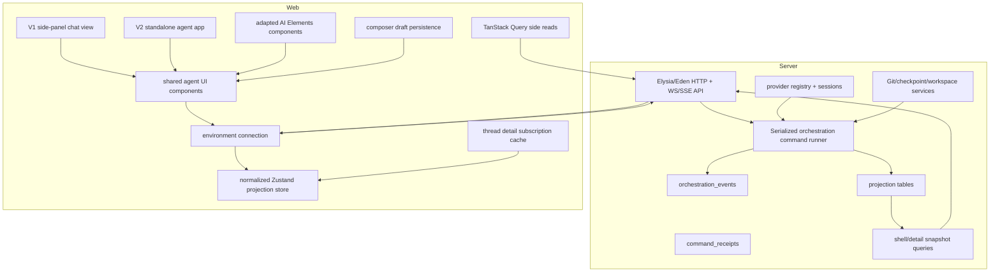

# Platform Agent Architecture Plan

This plan turns the T3Code reference into implementation phases for Platform.
The goal is not full T3Code parity. The goal is a Platform-native agent/chat
system that borrows T3Code's proven event/projection/runtime model where it
solves real Platform problems, while keeping Platform's stack:

- Bun
- Elysia/Eden
- Drizzle
- Valibot
- React
- Zustand
- TanStack Query
- existing `@workspace/ui` shadcn/Base UI components

We are not copying Effect as a backend requirement, and we are not treating
T3Code feature parity as the product target. We are copying the architecture
spine that makes T3Code fast and recoverable:

- append-only event log as durable truth
- command receipts/idempotency
- projection tables as the server read model
- projector progress through `projection_state`
- shell/detail snapshots and streams
- sequence-based client recovery
- provider sessions/runtime separation
- normalized bounded client projection cache

Product shape:

- V1 is a side-panel chat inside the existing Platform workspace.
- V1 still uses the real agent/chat core. The side panel must not own chat
  concepts or create throwaway components.
- V2 is a standalone agent app/workbench view, similar in spirit to T3Code,
  Codex, or Claude Code.
- V1 and V2 share contracts, transport, projection cache, runtime/session model,
  and reusable chat UI components.

Reference doc:

- `docs/t3code-reference.md`

Current Platform anchors:

- `apps/server/src/app.ts`
- `apps/server/src/db/schema.ts`
- `apps/server/src/git/*`
- `apps/server/src/fs/*`
- `apps/server/src/terminal/*`
- `packages/contracts/src/*`
- `apps/web/src/App.tsx`
- `apps/web/src/lib/query-client.ts`
- `packages/ui/src/components/*`

External component reference:

- `https://elements.ai-sdk.dev/`

AI Elements strategy:

- Use AI Elements as a component canvas/source reference for agent UI pieces.
  The library is built on shadcn/ui conventions and installs component source
  into the app, which makes it a good starting point for Platform-specific
  customization.
- Default workflow for agent UI work: inspect the relevant AI Elements source
  first, adapt it into Platform-owned components, and then apply T3Code/Platform
  behavior on top. Start from scratch only when AI Elements has no relevant
  component or when adapting it would add more complexity than it removes.
- Do not treat AI Elements behavior as authoritative when it diverges from the
  T3Code architecture. T3Code remains the first reference for transcript
  performance, projection-driven state, shell/detail subscriptions, recovery,
  composer persistence, and runtime semantics.
- Keep the full AI Elements registry installed locally so the source is ready
  while building. Only wire product surfaces to components we intentionally
  adapt for Platform.
- Reshape imported component code to Platform conventions, including one React
  component per file and feature-specific utilities outside component files.
- Keep AI Elements files editable and local. As we build, modify the copied
  components directly instead of wrapping them indefinitely with workaround
  layers.
- Prefer AI Elements markup, accessibility, and shadcn-compatible styling as the
  starting point; replace the state and data flow with Platform/T3-style
  projection data.
- Example rule: if AI Elements `Conversation` uses `useStickToBottom` but the
  T3-style transcript needs Legend List behavior, use Legend List and adapt the
  AI Elements visual structure around it.

## Target Shape

## Phase 0: Scope Lock And Source Map

Purpose:

- Freeze the first Platform agent target so we do not implement T3Code all at
  once.
- Decide the first provider/runtime target.
- Decide transport details.
- Decide which T3Code architecture pieces are copied and which product features
  are deferred.
- Decide which AI Elements components are worth adapting for V1.

Locked decisions:

- T3Code parity is not the goal. Platform owns the product shape.
- Phase 0 is documentation/spec work only. Do not add runtime code, migrations,
  schemas, routes, or UI implementation in this phase.
- V1 is local-only chat in the existing workspace. The first product surface is
  a chat tab in the left workspace sidebar, not a standalone app and not a
  remote environment.
- Backend truth: the append-only event log is durable truth. Projection tables
  are the server read model. The UI never owns durable transcript state.
- Frontend component sourcing: use AI Elements as a starting canvas where it
  helps, but T3Code wins for behavior, data flow, performance, and recovery.
- Event store: required in V1.
- Server projections: required in V1. They are the fast read model over the
  append-only log, not optional polish.
- Client projection cache: Zustand in V1. TanStack DB is a later evaluation
  after the T3-style store is proven in Platform.
- TanStack Query: command request lifecycle and side reads only, not the durable
  chat transcript owner.
- Recovery: design snapshots/events with sequence guards from the start.
  Replay can be simplified in the first slice, but the contracts must not block
  replay recovery later.
- Transport: all-in on Eden/Elysia. Use Eden HTTP for command dispatch,
  snapshots, and replay. Use Elysia/Eden WebSockets for shell/detail
  subscriptions. Each stream sends one initial snapshot followed by
  sequence-tagged updates.
- First provider adapter: Codex first. Mocks are allowed for automated tests, but
  the product path starts with Codex. The default driver kind is `codex`, and
  the default provider instance ID is `codex`.
- First runtime mode: `full-access`. Keep `approval-required` and
  `auto-accept-edits` in contracts/data as supervised-mode placeholders, but do
  not build supervised UI or enforcement in V1.
- First UI shape: extend the existing workspace left rail with a chat symbol and
  render chat as a left-sidebar tab. This side panel is a view over shared agent
  core/components.
- Second UI shape: standalone agent app/workbench view using the same
  contracts, projection cache, runtime, and UI primitives.
- First persistence scope: one local backend environment. Remote environments
  come later.

Deliverables:

- Finalized command/event/schema list for phase 1.
- Codex-first provider/runtime assumptions for phase 7.
- Full-access-first runtime mode contract with supervised placeholders.
- Left-sidebar chat entry/panel UI target.
- Standalone app reuse constraints for shared chat components.
- AI Elements adoption map for V1 components, with divergence notes where
  Platform follows T3Code behavior instead.
- A short "not in v1" list.

Phase 1 locked contract names:

- Contract modules are Platform-owned Valibot/TypeScript modules under
  `packages/contracts/src`: `chat-ids.ts`, `chat-model.ts`,
  `orchestration-commands.ts`, `orchestration-events.ts`,
  `orchestration-snapshots.ts`, and `orchestration-runtime.ts`.
- Opaque ID schemas/types: `ProjectId`, `ThreadId`, `MessageId`, `TurnId`,
  `CommandId`, `EventId`, `ProviderInstanceId`, `ApprovalRequestId`, and
  `ProposedPlanId`.
- Runtime/provider schemas:
  - `RuntimeMode`: `full-access`, `approval-required`, `auto-accept-edits`.
  - `InteractionMode`: `default`, `plan`.
  - `ProviderDriverKind`: open slug; first built-in/default value is `codex`.
  - `ProviderInstanceId`: open slug; first/default value is `codex`.
  - `ModelSelection`: `{ providerInstanceId, model, options? }`.
- Client-dispatchable commands for Phase 1 schemas:
  - `project.create`
  - `project.meta.update`
  - `project.delete`
  - `thread.create`
  - `thread.meta.update`
  - `thread.delete`
  - `thread.archive`
  - `thread.unarchive`
  - `thread.runtime-mode.set`
  - `thread.interaction-mode.set`
  - `thread.turn.start`
  - `thread.turn.interrupt`
  - `thread.session.stop`
  - `thread.approval.respond`
  - `thread.user-input.respond`
- Internal/runtime commands for Phase 1 schemas:
  - `thread.session.set`
  - `thread.message.assistant.delta`
  - `thread.message.assistant.complete`
  - `thread.activity.append`
  - `thread.proposed-plan.upsert`
  - `thread.turn.diff.complete`
  - `thread.revert.complete`
- Do not add separate client commands for proposed-plan accept/follow-up in
  Phase 1. Later plan follow-up or implementation turns use
  `thread.turn.start.sourceProposedPlan`; runtime plan materialization uses the
  internal `thread.proposed-plan.upsert` command.
- Domain events for Phase 1 schemas:
  - `project.created`
  - `project.meta-updated`
  - `project.deleted`
  - `thread.created`
  - `thread.meta-updated`
  - `thread.deleted`
  - `thread.archived`
  - `thread.unarchived`
  - `thread.runtime-mode-set`
  - `thread.interaction-mode-set`
  - `thread.message-sent`
  - `thread.turn-start-requested`
  - `thread.turn-interrupt-requested`
  - `thread.session-stop-requested`
  - `thread.session-set`
  - `thread.activity-appended`
  - `thread.proposed-plan-upserted`
  - `thread.turn-diff-completed`
  - `thread.reverted`
  - `thread.approval-response-requested`
  - `thread.user-input-response-requested`
- Turn status is projected from `thread.turn-start-requested`,
  `thread.session-set`, runtime ingestion, and `projection_turns.state`. Do not
  introduce separate `thread.turn-started`, `thread.turn-completed`, or
  `thread.turn-failed` events in Phase 1.
- Snapshot/stream/replay contract types:
  - `OrchestrationShellSnapshot`
  - `OrchestrationThreadDetailSnapshot`
  - `OrchestrationShellStreamItem`
  - `OrchestrationThreadStreamItem`
  - `OrchestrationReplayEventsInput`
  - `OrchestrationReplayEventsResult`
  - `OrchestrationCommandReceipt`

Phase 1 locked persistence scope:

- Implement these tables first:
  - `orchestration_events`
  - `orchestration_command_receipts`
  - `projection_state`
  - `projection_projects`
  - `projection_threads`
  - `projection_thread_messages`
  - `projection_thread_activities`
  - `projection_thread_sessions`
  - `projection_turns`
  - `provider_session_runtime`
- Include shell-summary columns on `projection_threads` from the first
  migration: `latest_user_message_at`, `pending_approval_count`,
  `pending_user_input_count`, and `has_actionable_proposed_plan`.
- Include `runtime_mode`, `interaction_mode`, `model_selection_json`,
  `archived_at`, and `deleted_at` on `projection_threads` from the first
  migration.
- Include `provider_instance_id` on `projection_thread_sessions` and
  `provider_session_runtime` from the first migration.
- Store command/event/snapshot payloads as canonical JSON matching the
  contracts; do not parse command/event payloads with ad hoc string logic.
- Defer these tables until their product surfaces exist:
  - `projection_pending_approvals`
  - `projection_thread_proposed_plans`
  - checkpoint/diff projection tables

Transport source map:

- Add an Elysia group at `/orchestration`, mounted from `apps/server/src/app.ts`
  through an orchestration routes module.
- HTTP endpoints:
  - `POST /orchestration/commands` dispatches one client command and returns
    `{ sequence }`.
  - `GET /orchestration/shell-snapshot` returns the shell snapshot.
  - `GET /orchestration/thread-detail?threadId=...` returns one thread detail
    snapshot.
  - `POST /orchestration/replay` returns events after `afterSequence`, scoped by
    optional aggregate/thread filters when provided.
- WebSocket endpoints:
  - `WS /orchestration/shell` sends `OrchestrationShellStreamItem`.
  - `WS /orchestration/thread?threadId=...` sends
    `OrchestrationThreadStreamItem`.
- Streams must reject stale client state by sequence: clients ignore snapshots
  or events older than the current scoped sequence.

Left-sidebar UI source map:

- Extend `WorkspacePanelTab` in `apps/web/src/lib/workspace-cache.ts` with
  `chat`, and include it in the persisted tab schema.
- Extend `isWorkspacePanelTab()` and `workspacePanelTabTitle()` in
  `apps/web/src/components/workspace/workspace-view-utils.ts`.
- Add a Phosphor `ChatCircleIcon` activity tab in
  `apps/web/src/components/workspace/workspace-activity-bar.tsx`.
- Add a `TabsContent` for `chat` in
  `apps/web/src/components/workspace/workspace-sidebar.tsx`.
- Keep workspace-specific shell components thin. Shared chat components must
  live under `apps/web/src/features/chat/components/*` and must not import
  workspace-only state except through the side-panel wrapper.

AI Elements V1 adoption map:

- `apps/web/src/components/ai-elements/conversation.tsx`: use the visual
  container and scroll affordance as source material, but replace
  `use-stick-to-bottom` with the T3-style virtualized transcript behavior before
  product wiring. Do not wire `ConversationDownload` in V1.
- `apps/web/src/components/ai-elements/message.tsx`: adapt user/assistant
  message layout and action affordances, but replace `UIMessage` with Platform
  projection message types and split exported components into separate files.
- `apps/web/src/components/ai-elements/prompt-input.tsx`: use the composer
  structure as visual source material, but replace registry-local text,
  attachment, screenshot, and submit state with Platform composer draft state
  and orchestration commands. Attachments and screenshots stay out of V1.
- `Plan`, `Tool`, `Confirmation`, and `Reasoning` are inspect-later references
  for approvals/plans/tool activity phases. Do not wire them into V1 until their
  backend projections exist.
- Imported AI Elements files are editable source material. Before product use,
  reshape them to repository rules: one exported React component per component
  file, hooks in dedicated hook files, and pure helpers/constants in utility
  files.

Not in V1:

- remote environments
- standalone agent workbench routing
- supervised approvals UI/enforcement
- file mentions
- slash commands
- drag/drop or image attachments
- full model picker in the composer
- proposed-plan implementation flow
- checkpoints/diffs/revert
- terminal context insertion
- TanStack DB
- locally persisted transcript data

T3 source paths:

- `docs/t3code-reference.md`
- `references/t3code/packages/contracts/src/orchestration.ts`
- `references/t3code/packages/contracts/src/providerInstance.ts`
- `references/t3code/packages/contracts/src/providerRuntime.ts`
- `references/t3code/apps/server/src/orchestration/Schemas.ts`
- `references/t3code/apps/server/src/orchestration/decider.ts`
- `references/t3code/apps/server/src/orchestration/Layers/ProviderRuntimeIngestion.ts`
- `references/t3code/apps/web/src/components/ChatView.tsx`
- `references/t3code/apps/web/src/components/chat/ChatComposer.tsx`
- `apps/web/src/components/ai-elements/conversation.tsx`
- `apps/web/src/components/ai-elements/message.tsx`
- `apps/web/src/components/ai-elements/prompt-input.tsx`

## Phase 1: Contracts And Persistence Foundation

Purpose:

- Add the durable backend data model that every later phase depends on.
- Keep contracts in `packages/contracts` so web/server stay in sync.
- Keep V1 narrow: define the full direction, but only implement the tables and
  events needed for the first local Codex chat slice.

Platform target paths:

- `packages/contracts/src/chat-*`
- `packages/contracts/src/orchestration-*`
- `apps/server/src/db/schema.ts`
- `apps/server/src/db/migrations.ts`
- `apps/server/src/orchestration/*`
- `apps/server/src/persistence/*`

Backend work:

- Add branded IDs or opaque string types:
  - `ProjectId`
  - `ThreadId`
  - `MessageId`
  - `TurnId`
  - `CommandId`
  - `EventId`
  - `ProviderInstanceId`
  - `ApprovalRequestId`
  - `ProposedPlanId`
- Add command schemas exactly as locked in Phase 0:
  - client-dispatchable project/thread/session/approval/user-input commands
  - internal runtime commands for session, assistant message, activity, proposed
    plan, turn diff, and revert materialization
  - no separate client proposed-plan accept/follow-up commands in Phase 1
- Add event schemas exactly as locked in Phase 0:
  - project lifecycle events
  - thread lifecycle/meta/runtime/interaction events
  - message, activity, session, proposed-plan, turn diff, revert,
    approval-response, and user-input-response events
  - no separate turn-started/turn-completed/turn-failed domain events
- Add SQLite/Drizzle tables for the V1 implemented subset:
  - `orchestration_events`
  - `orchestration_command_receipts`
  - `projection_state`
  - `projection_projects`
  - `projection_threads`
  - `projection_thread_messages`
  - `projection_thread_activities`
  - `projection_thread_sessions`
  - `projection_turns`
  - `provider_session_runtime`
- Deferred tables until their product surfaces exist:
  - `projection_pending_approvals`
  - `projection_thread_proposed_plans`
  - checkpoint/diff projection tables
- Add indexes for:
  - events by sequence
  - events by aggregate
  - threads by project/deleted/created
  - messages by thread/created
  - activities by thread/created
  - sessions by provider session
  - sessions by provider instance

Frontend work:

- None beyond importing new contract types.

Tests:

- Schema validation tests.
- Migration/table creation tests.
- Event serialization round-trip tests.
- Projection table index tests for shell/detail lookup paths.

Done when:

- Server can create an empty DB with the V1 orchestration tables.
- Contracts compile in web and server.
- Event/command schema tests pass.
- The first slice tables can support shell snapshot, thread detail snapshot, and
  event replay from sequence without scanning unrelated UI data.

T3 source paths:

- `references/t3code/packages/contracts/src/*`
- `references/t3code/apps/server/src/orchestration/Schemas.ts`
- `references/t3code/apps/server/src/persistence/Migrations/001_OrchestrationEvents.ts`
- `references/t3code/apps/server/src/persistence/Migrations/002_OrchestrationCommandReceipts.ts`
- `references/t3code/apps/server/src/persistence/Migrations/004_ProviderSessionRuntime.ts`
- `references/t3code/apps/server/src/persistence/Migrations/005_Projections.ts`
- `references/t3code/apps/server/src/persistence/Migrations/013_ProjectionThreadProposedPlans.ts`
- `references/t3code/apps/server/src/persistence/Migrations/023_ProjectionThreadShellSummary.ts`

## Phase 2: Orchestration Core

Purpose:

- Build T3Code's backend truth model: command in, events out, projections update.

Platform target paths:

- `apps/server/src/orchestration/event-store.ts`
- `apps/server/src/orchestration/command-receipts.ts`
- `apps/server/src/orchestration/read-model.ts`
- `apps/server/src/orchestration/projector.ts`
- `apps/server/src/orchestration/decider.ts`
- `apps/server/src/orchestration/engine.ts`
- `apps/server/src/orchestration/projection-pipeline.ts`
- `apps/server/src/orchestration/snapshot-query.ts`
- `apps/server/src/orchestration/routes.ts`

Backend work:

- Implement append-only event store.
- Implement command receipt dedupe.
- Implement in-memory read model.
- Implement pure projector over events.
- Implement decider for minimal thread lifecycle:
  - create project
  - create thread
  - start turn
  - append user message
  - set session state
  - append assistant/runtime activity
- Implement serialized command runner.
- Implement durable projection pipeline.
- Implement bootstrap:
  - run projection catch-up
  - load full snapshot into hot read model
- Implement snapshot queries:
  - full snapshot for engine bootstrap
  - shell snapshot for sidebar
  - thread detail snapshot by thread ID
- Add sequence/version to snapshots and event batches.

Frontend work:

- None yet, except possibly a debug route/client to call the backend.

Tests:

- Command dedupe.
- Decider emits expected events.
- Projector rebuilds read model from events.
- Projection pipeline persists expected rows.
- Snapshot queries produce shell/detail shape.
- Replay from event store yields same read model.

Done when:

- A server test can create a project/thread, dispatch a turn-start command, and
  read back shell/detail snapshots.

T3 source paths:

- `references/t3code/apps/server/src/orchestration/Layers/OrchestrationEngine.ts`
- `references/t3code/apps/server/src/orchestration/decider.ts`
- `references/t3code/apps/server/src/orchestration/projector.ts`
- `references/t3code/apps/server/src/orchestration/Layers/ProjectionPipeline.ts`
- `references/t3code/apps/server/src/orchestration/Layers/ProjectionSnapshotQuery.ts`
- `references/t3code/apps/server/src/persistence/Layers/OrchestrationEventStore.ts`
- `references/t3code/apps/server/src/persistence/Layers/OrchestrationCommandReceipts.ts`

## Phase 3: Shell/Detail Transport

Purpose:

- Expose the projection model to the frontend the T3Code way.

Platform target paths:

- `apps/server/src/orchestration/routes.ts`
- `apps/server/src/orchestration/streams.ts`
- `apps/server/src/app.ts`
- `apps/web/src/features/chat/transport/*`
- `apps/web/src/features/chat/environment/*`

Backend work:

- Add Eden-backed command dispatch endpoint.
- Add shell subscription:
  - initial shell snapshot
  - project/thread upsert/remove stream events
- Add thread detail subscription:
  - initial detail snapshot
  - detail events scoped by thread ID
- Convert domain events into shell events by querying projections.
- Filter thread detail events to:
  - message sent
  - activity appended
  - proposed plan upserted
  - turn diff completed
  - thread reverted
  - session set
- Add replay/resubscribe behavior for WebSocket streams.
- Keep SSE available for one-way stream cases if it is simpler than a socket.

Frontend work:

- Add local environment connection abstraction.
- Add typed Eden orchestration client.
- Add reconnect behavior and stale sequence guards.

Tests:

- Shell stream emits initial snapshot.
- Detail stream emits only target-thread events.
- Out-of-order older snapshot/event is rejected client-side.
- Reconnect can resubscribe and recover latest state.

Done when:

- A local Eden client can dispatch commands, subscribe to shell and one thread
  detail stream, and see live events after dispatch.

T3 source paths:

- `references/t3code/apps/server/src/ws.ts`
- `references/t3code/apps/web/src/rpc/wsRpcClient.ts`
- `references/t3code/apps/web/src/rpc/wsTransport.ts`
- `references/t3code/apps/web/src/environmentApi.ts`
- `references/t3code/apps/web/src/environments/runtime/service.ts`

## Phase 4: Frontend Projection Cache

Purpose:

- Implement the T3Code-style client projection cache with Zustand.
- Keep it in memory; backend remains truth.
- Keep the cache shaped so a later TanStack DB evaluation is possible, but do
  not block V1 on TanStack DB.

Platform target paths:

- `apps/web/src/features/chat/state/chat-projection-store.ts`
- `apps/web/src/features/chat/state/chat-projection-selectors.ts`
- `apps/web/src/features/chat/state/chat-projection-writers.ts`
- `apps/web/src/features/chat/state/thread-detail-subscriptions.ts`
- `apps/web/src/features/chat/state/chat-cache-constants.ts`

Frontend work:

- Add normalized store slices:
  - projects
  - thread shells
  - thread IDs by project
  - thread sessions
  - thread turn states
  - messages
  - activities
  - proposed plans
  - turn diff summaries
  - sidebar thread summaries
- Minimum V1 implemented subset:
  - projects
  - thread shells
  - thread IDs by project
  - thread sessions
  - thread turn states
  - messages
  - activities
  - sidebar thread summaries
- Defer proposed-plan, turn-diff, approval, and checkpoint slices until their
  server projections and UI surfaces exist.
- Add shell writer.
- Add detail writer.
- Add snapshot sync functions.
- Add event apply functions.
- Add sequence/version guards.
- Add caps:
  - 2,000 messages
  - 500 checkpoints
  - 200 proposed plans
  - 500 activities
- Add ref-counted thread detail subscription cache:
  - 15 minute idle eviction
  - max 32 cached detail subscriptions
  - protect running/pending/actionable threads
- Add sidebar prewarm helper for first 10 visible threads.

Backend work:

- Adjust snapshot/event shape as frontend needs become clear.

Tests:

- Shell snapshot preserves existing detail for still-present threads.
- Deleted thread removes scoped state.
- Detail snapshot updates only thread detail.
- Caps trim arrays deterministically.
- Detail subscription retain/release/eviction behavior.

Done when:

- Frontend can maintain chat state across shell/detail snapshots and live events
  without React Query storing transcripts.

T3 source paths:

- `references/t3code/apps/web/src/store.ts`
- `references/t3code/apps/web/src/storeSelectors.ts`
- `references/t3code/apps/web/src/environments/runtime/service.ts`
- `references/t3code/apps/web/src/components/Sidebar.logic.ts`
- `references/t3code/apps/web/src/components/Sidebar.tsx`

## Phase 5: Side Panel Chat V1

Purpose:

- Ship the first usable left-sidebar chat panel on top of the shared agent
  core, projection cache, and reusable chat components.
- Treat the side panel as the first view into the real agent app, not as a
  one-off implementation.

Platform target paths:

- `apps/web/src/features/chat/components/chat-sidebar-entry.tsx`
- `apps/web/src/features/chat/components/chat-side-panel.tsx`
- `apps/web/src/features/chat/components/thread-list.tsx`
- `apps/web/src/features/chat/components/chat-view.tsx`
- `apps/web/src/features/chat/components/chat-header.tsx`
- `apps/web/src/features/chat/components/chat-composer.tsx`
- `apps/web/src/features/chat/components/messages-timeline.tsx`
- `apps/web/src/components/workspace/workspace-view.tsx`
- `apps/web/src/App.tsx`

Candidate AI Elements source components:

- `Conversation`, `ConversationContent`, `ConversationScrollButton`
- `Message`, `MessageContent`, `MessageResponse`
- `PromptInput`, `PromptInputTextarea`, `PromptInputSubmit`
- later: `Tool`, `Task`, `Plan`, `Checkpoint`, `File Tree`, `Terminal`

Frontend work:

- Adapt selected AI Elements components into Platform-owned files and refactor
  them to match local component/file organization.
- Replace AI Elements conversation scrolling with the T3Code/Legend List
  transcript model:
  - virtualized transcript rows
  - stable row identity
  - maintain-scroll-at-end behavior
  - explicit scroll-to-bottom affordance
  - no full-detail subscription for inactive sidebar threads
- Add a chat symbol/button to the existing left sidebar or side rail.
- Render chat as a left-sidebar panel for now.
- Keep the layout narrow and sidebar-native; defer right-side panel/split-pane
  layout work.
- Keep components layout-aware so the same transcript, header, thread list, and
  composer primitives can render in the future standalone app.
- Add thread list from shell summaries.
- Add create-thread flow.
- Add active-thread view from detail selectors.
- Add rich composer foundation with restrained V1 features:
  - multiline textarea/editor base
  - send button
  - stop/cancel placeholder
  - disabled/loading states
  - draft persistence boundary
  - keyboard behavior
  - layout slots for future context chips, attachments, runtime mode, and model
    controls
- Use AI Elements `PromptInput` as a visual/composition reference, but route
  submit, draft, disabled, stop, and optimistic-send behavior through Platform
  chat state and orchestration commands.
- Hold back visible advanced composer features:
  - no file mentions yet
  - no slash commands yet
  - no drag/drop attachments yet
  - no inline autocomplete yet
  - no full model picker inside the composer yet
  - no selected-code context UI yet
- Add basic timeline:
  - user messages
  - assistant messages
  - activities
  - working state
  - error state
- Add optimistic user message.
- Add failed-send restoration.
- Add empty states and loading states.

Backend work:

- Support minimal commands needed by the UI.

Tests:

- Create thread from panel.
- Send prompt.
- See optimistic message.
- Receive server message/event.
- Failed send restores composer content.

Done when:

- User can click the chat symbol in the left sidebar, create a thread, send a
  prompt, and see a backend-owned transcript update through projection streams.

T3 source paths:

- `references/t3code/apps/web/src/components/ChatView.tsx`
- `references/t3code/apps/web/src/components/ChatView.logic.ts`
- `references/t3code/apps/web/src/components/chat/ChatHeader.tsx`
- `references/t3code/apps/web/src/components/chat/MessagesTimeline.tsx`
- `references/t3code/apps/web/src/components/chat/MessagesTimeline.logic.ts`

AI Elements source references:

- `https://elements.ai-sdk.dev/components/conversation`
- `https://elements.ai-sdk.dev/components/message`
- `https://elements.ai-sdk.dev/components/prompt-input`
- `https://elements.ai-sdk.dev/examples/chatbot`

## Phase 6: Composer, Drafts, Attachments, Mentions

Purpose:

- Expand the rich composer foundation after the first chat slice works.
- Add advanced context and attachment features incrementally instead of making
  them prerequisites for V1.

Platform target paths:

- `apps/web/src/features/chat/components/chat-composer.tsx`
- `apps/web/src/features/chat/components/composer-command-menu.tsx`
- `apps/web/src/features/chat/components/provider-model-picker.tsx`
- `apps/web/src/features/chat/state/composer-draft-store.ts`
- `apps/web/src/features/chat/lib/composer-logic.ts`
- `apps/web/src/features/chat/lib/composer-attachments.ts`
- `apps/web/src/features/chat/lib/project-entry-query.ts`

Frontend work:

- Continue using AI Elements as the component canvas where it speeds up
  implementation, but keep T3Code behavior as the source for composer lifecycle,
  draft promotion, context staging, and runtime controls.
- Add versioned draft store:
  - prompt
  - selected model/provider
  - runtime mode
  - interaction mode
  - terminal contexts
  - image attachment metadata
  - draft-to-thread promotion state
- Add debounced local persistence with explicit flush on unload.
- If not already completed in phase 5, finish base draft persistence for the
  plain prompt and selected thread.
- Add image paste/drop support.
- Store pending image attachments as data URLs when needed.
- Revoke object URLs.
- Add project file/folder mentions.
- Add slash command menu.
- Decide whether to stay textarea or move to Lexical:
  - v1 can stay textarea with external chips
  - Lexical can come when inline chips become necessary

Backend work:

- Add attachment materialization if server-side images are in scope.
- Add filesystem/project search endpoint reuse if needed.

Tests:

- Draft persists and hydrates.
- Draft clears after successful send.
- Failed send restores prompt/images.
- Attachment persistence handles storage failure.
- Mentions resolve to stable paths.

Done when:

- Composer survives reloads, handles attachments, stages project context, and
  still works in both side-panel and standalone layouts.

T3 source paths:

- `references/t3code/apps/web/src/composerDraftStore.ts`
- `references/t3code/apps/web/src/components/chat/ChatComposer.tsx`
- `references/t3code/apps/web/src/components/ComposerPromptEditor.tsx`
- `references/t3code/apps/web/src/components/chat/ComposerCommandMenu.tsx`
- `references/t3code/apps/web/src/components/chat/ProviderModelPicker.tsx`
- `references/t3code/apps/web/src/components/composerInlineChip.ts`
- `references/t3code/apps/web/src/lib/projectReactQuery.ts`

## Phase 7: Provider Runtime V1

Purpose:

- Add the first real T3Code-shaped provider runtime, starting with Codex.

Platform target paths:

- `apps/server/src/provider/*`
- `apps/server/src/provider/adapters/*`
- `apps/server/src/orchestration/provider-runtime-ingestion.ts`
- `apps/server/src/orchestration/provider-command-reactor.ts`
- `apps/server/src/orchestration/runtime-receipts.ts`
- `packages/contracts/src/provider-*`
- `apps/web/src/features/chat/components/provider-model-picker.tsx`

Backend work:

- Add provider instance settings:
  - driver kind
  - provider instance ID
  - display label
  - auth/status
  - model list
  - traits/capabilities
- Add provider status cache.
- Add provider registry.
- Add provider session runtime persistence.
- Add Codex provider adapter first.
- Add command reactor:
  - start turn
  - interrupt turn
  - respond approval
  - respond user input
  - stop session
- Add runtime ingestion:
  - stream text deltas
  - buffer assistant text
  - append activities
  - upsert proposed plans
  - handle completion/failure
- Add dedupe for provider turn-start keys.

Frontend work:

- Render provider status.
- Render provider/model picker.
- Lock provider selection for already-started threads when needed.
- Surface provider errors in thread state.

Tests:

- Provider registry hydrates status.
- Start turn creates provider session runtime.
- Runtime deltas become message events.
- Duplicate runtime events are deduped.
- Interrupt and failure paths update projections.
- Mock provider remains available only as a deterministic test harness.

Done when:

- Codex can run a full-access thread turn and stream assistant output into the
  T3-style projection pipeline.

T3 source paths:

- `references/t3code/apps/server/src/provider/ProviderDriver.ts`
- `references/t3code/apps/server/src/provider/providerStatusCache.ts`
- `references/t3code/apps/server/src/provider/Layers/ProviderRegistry.ts`
- `references/t3code/apps/server/src/provider/Layers/ProviderInstanceRegistryLive.ts`
- `references/t3code/apps/server/src/provider/Layers/ProviderService.ts`
- `references/t3code/apps/server/src/provider/Layers/ProviderSessionDirectory.ts`
- `references/t3code/apps/server/src/persistence/Layers/ProviderSessionRuntime.ts`
- `references/t3code/apps/server/src/orchestration/Layers/ProviderRuntimeIngestion.ts`
- `references/t3code/apps/server/src/orchestration/Layers/ProviderCommandReactor.ts`

## Phase 8: Approvals, User Input, Plans

Purpose:

- Implement the stateful agent interaction paths that make T3Code more than a
  basic chat box.

Platform target paths:

- `apps/server/src/orchestration/approval-*`
- `apps/server/src/orchestration/proposed-plan-*`
- `apps/web/src/features/chat/components/composer-pending-approval-panel.tsx`
- `apps/web/src/features/chat/components/composer-pending-user-input-panel.tsx`
- `apps/web/src/features/chat/components/proposed-plan-card.tsx`
- `apps/web/src/features/chat/lib/session-logic.ts`

Backend work:

- Add pending approval projection behavior.
- Add pending user input projection behavior.
- Add proposed plan projection behavior.
- Add commands:
  - approval respond
  - user input respond
  - plan follow-up
  - plan implement
- Make pending states backend-owned facts.

Frontend work:

- Derive open approvals/user-input from activities/projections.
- Change composer surface based on pending state.
- Add approval action buttons.
- Add user-input answer flow.
- Add proposed plan card and follow-up CTA.
- Add plan implementation path into a new or existing thread.

Tests:

- Pending approval appears after provider event.
- Approval response dispatches command and clears pending state.
- User input request blocks normal send and accepts response.
- Proposed plan upserts and follow-up sends correct command.

Done when:

- Tool approval/user-input/plan loops are backend-owned and visible in chat UI.

T3 source paths:

- `references/t3code/apps/web/src/components/chat/ComposerPendingApprovalPanel.tsx`
- `references/t3code/apps/web/src/components/chat/ComposerPendingApprovalActions.tsx`
- `references/t3code/apps/web/src/components/chat/ComposerPendingUserInputPanel.tsx`
- `references/t3code/apps/web/src/components/chat/ComposerPlanFollowUpBanner.tsx`
- `references/t3code/apps/web/src/components/chat/ProposedPlanCard.tsx`
- `references/t3code/apps/server/src/orchestration/Layers/ProjectionPipeline.ts`
- `references/t3code/apps/server/src/orchestration/decider.ts`

## Phase 9: Checkpoints, Diffs, Revert, Git Integration

Purpose:

- Add the T3Code agent workflow around file changes.

Platform target paths:

- `apps/server/src/checkpointing/*`
- `apps/server/src/orchestration/checkpoint-reactor.ts`
- `apps/server/src/git/*`
- `apps/web/src/features/chat/components/changed-files-tree.tsx`
- `apps/web/src/features/chat/components/diff-sidebar.tsx`
- `apps/web/src/features/chat/lib/checkpoint-diff-query.ts`

Backend work:

- Add hidden Git-ref checkpoint store.
- Capture checkpoint at turn boundaries.
- Add checkpoint projection into thread turn state.
- Add checkpoint diff query by turn range.
- Add full-thread diff query.
- Add revert-to-checkpoint command.
- Integrate with existing Platform Git service where possible.
- Add Git status invalidation after checkpoint/revert operations.

Frontend work:

- Show changed files per assistant turn.
- Show diff panel/sidebar.
- Add revert-to-message/checkpoint action.
- Cache checkpoint diffs with TanStack Query using infinite stale time for
  immutable ranges.

Tests:

- Checkpoint captures workspace state.
- Diff query returns expected patch.
- Revert restores files.
- Projection updates after revert.
- UI requests and caches diff by stable key.

Done when:

- Agent turns have checkpoints, changed-file summaries, diff viewing, and revert.

T3 source paths:

- `references/t3code/apps/server/src/checkpointing/Layers/CheckpointStore.ts`
- `references/t3code/apps/server/src/checkpointing/Layers/CheckpointDiffQuery.ts`
- `references/t3code/apps/server/src/checkpointing/Utils.ts`
- `references/t3code/apps/server/src/orchestration/Layers/CheckpointReactor.ts`
- `references/t3code/apps/web/src/lib/providerReactQuery.ts`
- `references/t3code/apps/web/src/components/chat/ChangedFilesTree.tsx`
- `references/t3code/apps/web/src/components/DiffWorkerPoolProvider.tsx`

## Phase 10: Remote Mode And Auth

Purpose:

- Add T3Code-style saved remote environments after local mode is stable.

Platform target paths:

- `apps/server/src/auth/*`
- `apps/server/src/environment/*`
- `apps/web/src/features/environments/*`
- `apps/web/src/features/chat/environment/*`

Backend work:

- Add bootstrap credential/session credential model.
- Add bearer/session token auth for remote WebSocket/API.
- Add server environment descriptor.
- Add pairing flow if needed.
- Scope events/snapshots by environment.

Frontend work:

- Add saved environment registry.
- Persist remote environment metadata locally.
- Store remote bearer token securely where possible.
- Connect/disconnect/reconnect saved environments.
- Show auth/connection state in UI.
- Ensure client chat cache remains in-memory and hydrates from remote snapshots.

Tests:

- Add saved environment.
- Persist and hydrate saved environment metadata.
- Missing credential shows requires-auth state.
- Remote shell/detail subscriptions hydrate after reconnect.

Done when:

- Platform can connect to a remote backend environment and hydrate chat via the
  same shell/detail projection streams.

T3 source paths:

- `references/t3code/apps/web/src/environments/runtime/catalog.ts`
- `references/t3code/apps/web/src/environments/runtime/service.ts`
- `references/t3code/apps/web/src/environments/remote/api.ts`
- `references/t3code/apps/server/src/auth/Layers/ServerAuth.ts`
- `references/t3code/apps/server/src/auth/Layers/SessionCredentialService.ts`
- `references/t3code/apps/server/src/auth/Layers/BootstrapCredentialService.ts`
- `references/t3code/apps/server/src/auth/Layers/AuthControlPlane.ts`

## Phase 11: Performance Caches And Hardening

Purpose:

- Add the bounded service caches and UI performance details that make T3Code
  feel stable under real usage.

Platform target paths:

- `apps/server/src/cache/*`
- `apps/server/src/workspace/*`
- `apps/server/src/project/*`
- `apps/web/src/features/chat/lib/markdown/*`
- `apps/web/src/features/chat/components/messages-timeline.tsx`
- `apps/web/src/features/chat/components/chat-markdown.tsx`

Backend work:

- Add small TTL/LRU helper.
- Add SQLite prepared statement cache if useful with current DB layer.
- Add provider status disk cache.
- Add Git status 1s cache and remote polling while subscribed.
- Add Git upstream fetch throttle.
- Add workspace entry cache:
  - 15s TTL
  - max 4 workspace keys
  - max 25k entries
- Add repository identity cache:
  - 512 entries
  - 1 minute positive/negative TTL
- Add keybinding/config cache if needed for agent commands.

Frontend work:

- Add markdown renderer with code/file link support.
- Add markdown highlight LRU:
  - 500 entries
  - 50MB
  - no caching streaming code blocks
- Add virtualized message timeline if native scroll starts struggling.
- Add diff worker pool if heavy diffs move to the client.
- Add render profiling around streaming messages.

Tests:

- Cache invalidation tests.
- Failure TTL tests for Git/workspace/repo identity.
- Long-thread timeline render tests.
- Markdown/file link tests.
- Reconnect and replay tests.

Done when:

- Long threads, large workspaces, remote Git status, and streaming output do not
  create obvious UI or backend churn.

T3 source paths:

- `references/t3code/apps/server/src/persistence/NodeSqliteClient.ts`
- `references/t3code/apps/server/src/git/Layers/GitManager.ts`
- `references/t3code/apps/server/src/git/Layers/GitCore.ts`
- `references/t3code/apps/server/src/git/Layers/GitStatusBroadcaster.ts`
- `references/t3code/apps/server/src/workspace/Layers/WorkspaceEntries.ts`
- `references/t3code/apps/server/src/project/Layers/RepositoryIdentityResolver.ts`
- `references/t3code/apps/web/src/components/ChatMarkdown.tsx`
- `references/t3code/apps/web/src/lib/lruCache.ts`
- `references/t3code/apps/web/src/components/chat/MessagesTimeline.tsx`

## Phase 12: Observability, Tests, Migration Safety

Purpose:

- Make the new system debuggable enough to maintain.

Platform target paths:

- `apps/server/src/observability/*`
- `apps/server/src/orchestration/*.test.ts`
- `apps/web/src/features/chat/**/*.test.ts`
- `apps/web/src/features/chat/**/*.browser.tsx`

Backend work:

- Add structured logs for command dispatch.
- Add timings:
  - command queue wait
  - command duration
  - projection duration
  - provider turn duration
  - stream subscriber count
- Add replay/debug endpoint for local development if safe.
- Add migration rollback/rebuild notes.
- Add projection rebuild command for dev.

Frontend work:

- Add debug panel or dev-only logging for:
  - active environment
  - projection sequence
  - active detail subscriptions
  - current thread status
- Add browser tests for major chat flows.

Tests:

- End-to-end local thread run.
- Replay from empty projection tables.
- Reconnect during stream.
- Server restart during idle thread.
- Provider failure during stream.
- Approval/user input interruption.
- Revert and checkpoint cleanup.

Done when:

- We can diagnose state bugs without guessing whether truth lives in UI,
  projection tables, or event store.

T3 source paths:

- `references/t3code/apps/server/src/observability/*`
- `references/t3code/apps/server/src/orchestration/Layers/OrchestrationEngine.test.ts`
- `references/t3code/apps/server/src/orchestration/Layers/ProjectionPipeline.test.ts`
- `references/t3code/apps/web/src/store.test.ts`
- `references/t3code/apps/web/src/composerDraftStore.test.ts`
- `references/t3code/apps/web/src/components/chat/MessagesTimeline.test.tsx`

## Parallel Workstreams

Some work can run in parallel once phase 1 contracts exist:

- Backend orchestration core and reusable frontend chat shell skeleton.
- Side-panel view and standalone-app component constraints.
- AI Elements component adaptation and T3Code divergence notes.
- Provider registry and composer control slots.
- Checkpoint store and changed-files UI.
- Draft persistence and projection store selectors.
- Git/workspace service caches and React Query side reads.

Do not parallelize these before the contracts settle:

- decider command/event names
- projection table schema
- shell/detail snapshot shapes
- provider session runtime shape

## First Vertical Slice

The first useful end-to-end slice should be deliberately small:

1. Create project.
2. Create thread.
3. Subscribe to shell.
4. Subscribe to thread detail.
5. Send text prompt.
6. Append optimistic user message.
7. Backend records command/events/projections.
8. Codex provider emits assistant text. Automated tests may use a deterministic
   mock adapter for this same runtime interface.
9. UI receives detail event and reconciles transcript.
10. Refresh or reconnect and recover the same thread from server projections.
11. Render the side-panel transcript through adapted AI Elements UI pieces while
    preserving T3Code/Legend List transcript behavior.

This proves the hardest architecture: backend truth, projections, streams, client
cache, reusable chat components, and the side-panel view.

Explicitly not in the first vertical slice:

- file mentions
- slash commands
- drag/drop attachments
- approvals/supervised mode UI
- proposed plans
- checkpoints/diffs/revert
- remote environments
- standalone app routing

## Risk Register

High risks:

- Building too much composer/provider UX before event/projection truth exists.
- Letting React Query become the chat transcript cache.
- Making the sidebar subscribe to full detail for every thread.
- Persisting remote chat data locally and creating two sources of truth.
- Adding provider-specific shortcuts before provider instance abstraction exists.
- Under-testing replay/reconnect/revert paths.
- Letting the V1 side panel create one-off chat components that cannot be reused
  by the V2 standalone app.
- Copying T3Code product scope instead of copying the proven architecture spine.
- Accidentally inheriting AI Elements runtime behavior where it conflicts with
  T3Code's projection, subscription, transcript, or recovery model.

Mitigations:

- Keep phase 1 and phase 2 narrow and test-heavy.
- Add the projection store before fancy UI.
- Use a mock provider only as a deterministic test harness; product runtime
  starts with Codex.
- Keep remote mode after local mode.
- Keep all caches bounded from the first implementation.
- Build shared chat components first, then wrap them with the side-panel view.
- Treat shell/detail projections, event sequence, and recovery as architecture
  requirements, not optional enhancements.
- Treat AI Elements as editable source material. Keep explicit divergence notes
  whenever Platform replaces AI Elements behavior with T3Code behavior.

## Open Decisions

- Whether to move from the V1 textarea composer foundation to Lexical when
  inline chips become necessary after V1.
- Whether hidden Git refs are acceptable for every workspace or should be
  opt-in.
- Exact supervised-mode policy after full-access v1.
- How much auth is needed before remote mode.
- Whether to add TanStack DB later for frontend projection collections after the
  Zustand version is proven.
