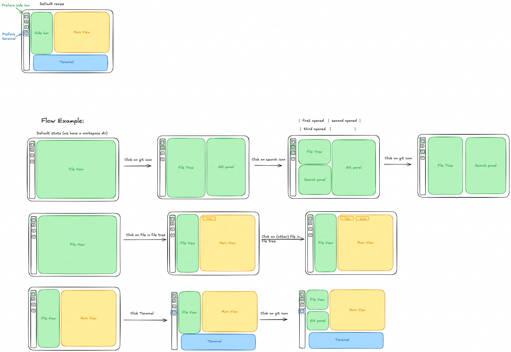

# Default Recipe

Date: 2026-06-06

Status: canonical V1 default recipe spec. This document defines the intended
default placement behavior. The implementation must use ordinary
surface-manager primitives: surfaces, windows, split nodes, rail state, and
recipe policy. Do not add a sidebar, dock, lane, or compatibility model to
represent this recipe.

## Reference

Editable source:
[Default recipe Excalidraw](https://excalidraw.com/#json=BAGs6x7SfdOmOPEjg0mWH,ETjVHiwYfRZRVSK3G1krSA).

The sketch uses the label "sidebar" as product shorthand. In code and durable
state this is a nested pane shape made from ordinary windows and split nodes,
not a model primitive.

## Vocabulary

- Rail: command surface for focusing, restoring, minimizing, and toggling
  surfaces or recipe-controlled panes. It is not layout storage.
- Tool surfaces: Files, Search, Git, Chat, and Logs.
- Main surfaces: file editors, diffs, and promoted previews.
- Bottom tool pane: Terminal and Problems grouped as a classic bottom pane.
  This is a temporary Phase 8 bridge until Phase 10 turns terminal sessions
  into true running surfaces.
- Nested panes: ordinary split-tree sublayouts that allow multiple windows on
  one side of the workspace without introducing `leftDock`, `rightDock`,
  `bottomDock`, `sidebar`, or lane node kinds.

## Default Shape

- The default recipe creates ordinary split nodes only.
- Tool surfaces prefer a left nested tool-pane group.
- Main surfaces prefer the main view to the right of the tool-pane group.
- The bottom tool pane spans below the content area and excludes the rail.
- The same split-tree primitives must support:
  - three tool windows stacked on the left;
  - one main item taking the full right side;
  - Terminal/Problems spanning below both.

When no main surface is visible, the first tool surface may use the available
work area. Opening a main surface creates or restores the main view and moves
tool surfaces back into the left nested tool-pane group through recipe
placement.

## Rail Behavior

- Clicking a hidden tool surface inserts or restores it into the left nested
  tool-pane group.
- Clicking a visible inactive tool surface focuses it.
- Clicking the active tool surface minimizes it.
- Clicking Terminal toggles the whole bottom tool pane, not only the Terminal
  tab.
- Logs is a tool surface in the left nested tool-pane group. It is not part of
  the Terminal/Problems bottom pane.

## Close And Restore Rules

- Tab close closes only that surface/tab.
- Window or pane close acts on the whole represented pane/window when the chrome
  is pane-level.
- Bottom tool pane close hides the Terminal/Problems pane and preserves its
  surfaces.
- Restore may reuse manual or sticky placement only when its target window still
  exists and is visible.
- Stale placement targeting missing or hidden windows falls back to default
  recipe placement.
- Rail restore means "make the recipe place this surface," not "reuse the last
  raw window id."

## Implementation Constraints

- No `sidebar` code primitive.
- No `leftDock`, `rightDock`, or `bottomDock` roots.
- No generic lane node kind for this recipe.
- No compatibility shim or duplicate layout truth.
- If insertion helpers are missing, add nested split placement helpers over the
  existing normalized model instead of adding a new layout model.
